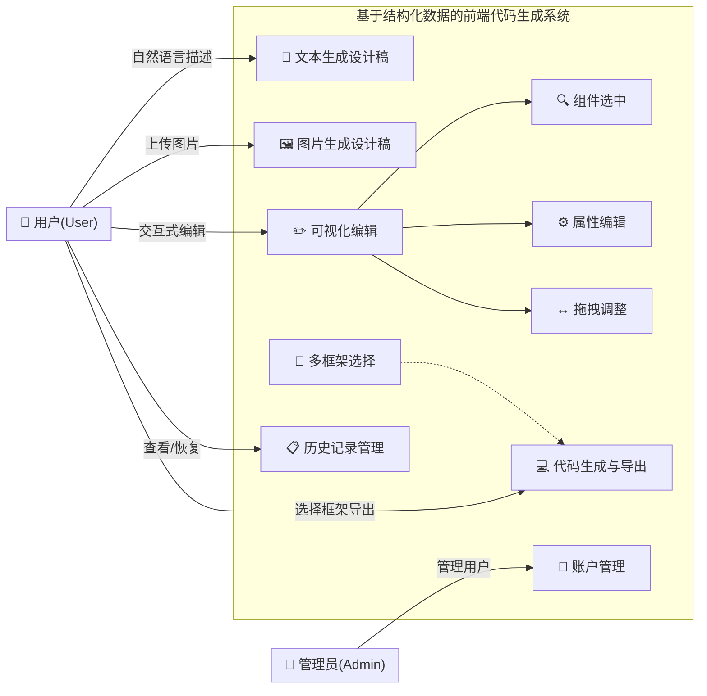
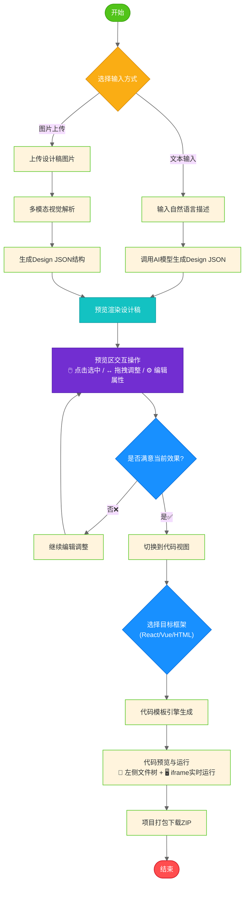

# 第三章 需求分析

本章从用户角度出发，系统地分析系统应该具备的功能需求和非功能需求。通过用例分析、场景描述等方式，明确系统的设计目标和验收标准，为后续的系统架构设计与详细实现奠定基础[18]。

## 3.1 功能需求分析

本系统面向前端开发者和非技术用户，旨在通过AI驱动的智能化流程降低页面设计与编码的门槛。通过对目标用户群体的调研与使用场景分析，系统被划分为四个核心功能模块：设计稿生成、可视化编辑、代码生成与导出、用户管理与历史记录。

### 3.1.1 设计稿生成模块

设计稿生成模块作为系统的核心入口，为用户提供文本驱动与图片驱动两种设计稿创建通道。该模块对接后端AI服务能力，将用户的自然语言描述或UI参考图片转化为结构化的Design JSON数据，为后续的可视化编辑与代码生成环节奠定数据基础。

**文本生成通道**支持用户通过自然语言描述快速创建设计稿。用户在输入框中输入自然语言描述（例如"创建一个包含标题、描述文本和提交按钮的登录表单页面"），系统将这段文本发送至后端AI服务接口，由大语言模型解析语义意图并输出结构化的Design JSON数据。从用户体验角度，用户期望输入描述后能在**3秒内**获得可预览的初步设计稿结果，且生成的内容在布局合理性上应达到可用水平——即组件层级关系正确、样式属性完整、整体排版符合常规网页设计规范。系统还需支持多轮对话上下文：当用户对首次生成结果不满意时，可以追加修改指令（如"把按钮改为圆角风格""增加一个忘记密码链接"），后端通过会话管理器维护同一sessionId下的对话历史，使AI能够基于前序交互进行增量式调整而非每次从头生成。

**图片生成通道**允许用户上传UI截图或手绘草图，借助多模态视觉模型解析并还原为可编辑设计稿。用户可以上传一张或多张UI截图、手绘草图或竞品页面图片（支持JPG/PNG/WebP格式，单张不超过10MB），系统调用多模态视觉模型对图像进行结构识别与元素分析，提取出其中的布局框架、组件类型、色彩方案等视觉特征，再据此生成对应的Design JSON。该场景的典型用例包括：产品经理上传Figma设计稿截图以快速还原为可编辑原型、设计师上传手绘线框图转化为数字版面、开发者截取参考网站页面并要求AI复刻类似效果。图片模式同样允许附加文字指令来补充或修正AI的解析结果（如"参照这张图片的配色，但改成卡片式布局"）。考虑到图片传输与模型推理的开销，此路径的响应时间阈值放宽至**5秒**，但仍需在前端提供加载动画与进度反馈以缓解等待焦虑[19]。

**输入预处理与校验机制**贯穿上述两条路径。在用户提交请求前，前端需完成以下校验：文本输入非空检查（去除首尾空白后长度≥1）、图片文件格式白名单校验（仅接受image/* MIME类型）、文件大小限制提示（超出10MB时拦截并给出明确错误信息）、并发请求防抖（isGenerating状态锁防止重复提交）。后端路由层通过multer中间件处理multipart/form-data格式的图片上传，配置diskStorage策略将文件持久化至uploads/images目录并以时间戳+随机数命名避免冲突。整个链路需确保异常情况的可追溯性——无论是网络超时、模型服务不可达还是返回格式解析失败，都应捕获错误对象并通过消息列表组件向用户展示友好的中文提示信息。

### 3.1.2 可视化编辑模块

可视化编辑模块采用"左侧画布实时渲染 + 右侧属性面板调控"的经典布局范式，为用户提供所见即所得的设计稿精调能力。该模块基于DesignRenderer递归渲染引擎实现Design JSON到可视化DOM的实时映射，配合属性面板的双向绑定机制，支持组件选中高亮、样式属性编辑、拖拽层级调整、撤销重做等五类核心交互操作[20]。

**实时预览渲染引擎**基于DesignRenderer组件实现Design JSON到可视化界面的即时映射。DesignRenderer组件接收当前的designJson状态树，递归遍历其节点结构并根据每个节点的type字段（container/text/button/image/input/card/divider等七种内置组件类型）渲染对应的DOM元素与内联样式。每当用户通过属性面板修改了任何字段值，updateNode工具函数会在深拷贝后的JSON树上定位到目标节点并执行属性合并，随后触发setDesignJson状态更新，React的协调机制随即驱动DesignRenderer重新渲染受影响的子树。这一过程需要在**100毫秒内**完成单次属性变更的画面刷新，以保证操作的即时反馈感。对于包含较多子组件的复杂页面（如超过20个节点），渲染引擎应利用React.memo优化避免全量重绘，最小化DOM操作范围。

**组件选中与高亮机制**通过useSelection Hook捕获用户点击事件，实现目标节点的快速定位与视觉反馈。用户点击画布中的任意组件元素时，useSelection Hook根据点击事件的target向上查找匹配的节点ID，将其设置为selectedId并在视觉上叠加蓝色边框高亮。同时右侧属性面板自动切换为该组件的专属编辑视图——显示其id（只读）、type（只读）、name（可编辑）、content/text（文本类组件可编辑），以及完整的style属性集。选中响应时间需控制在**50毫秒以内**，以确保操作的流畅性。

**属性面板双向绑定**按功能分区组织可编辑字段，提供五类属性的实时调控能力。基础属性区展示节点元信息；内容区提供textarea供编辑文本型组件的文字内容；样式区涵盖尺寸（width/height）、颜色（backgroundColor/color，同时提供取色器与十六进制文本双输入通道）、字体（fontSize）、圆角（borderRadius）、内边距（四向独立数值输入）、Flex布局属性（flexDirection/justifyContent/alignItems/gap，父容器节点独有）。每项属性的修改均绑定onChange事件处理器，调用handleUpdateStyle函数立即生效，反馈延迟应控制在**16毫秒以内**（即1帧的时间），实现真正的所见即所得体验。

**拖拽排序功能**基于useDragAndDrop Hook实现组件层级关系的动态调整。在被拖拽组件随鼠标移动的过程中，画布实时计算其相对于其他组件的位置关系并显示插入指示器（目标位置的高亮虚线框）。释放鼠标时，handleMoveNode函数判断放置语义——放入容器内部（dropPosition='inside'）或插入某组件的前/后方（before/after）——然后在JSON树上执行节点迁移操作。拖拽过程需维持**55fps以上**的帧率，且误操作率控制在**10%以下**。同时需防止非法操作：不能将父节点拖入自身子节点内部形成循环引用、不能将元素放入不支持子节点的叶子组件内部。

**操作历史管理**维护最大20步的状态快照栈，为用户的试错行为提供安全网。每次有效的编辑操作都会将新的designJson压入栈顶。用户按下Ctrl+Z/Ctrl+Y触发撤销重做操作，工具栏按钮的禁用状态与历史记录指针联动。特别地，当用户在已撤销的状态下执行新操作时，位于当前索引之后的所有历史记录将被清空，符合主流编辑器的标准交互范式。

### 3.1.3 代码生成与导出模块

代码生成与导出模块承担将确认后的Design JSON转换为可执行前端源码的任务。该模块内置React、Vue、HTML三种目标框架的代码模板引擎，采用适配器模式封装不同框架的生成逻辑，并提供代码预览运行与项目级打包下载的一站式交付能力[21]。

**多框架代码生成**是本模块的基础能力，支持React、Vue、HTML三种目标框架。React（Vite构建工具）、Vue（Vite构建工具）、原生HTML（CSS+JS）。生成的代码遵循各框架的最佳实践——React采用函数式组件+Hooks写法，Vue使用Composition API与单文件组件(SFC)，HTML则输出语义化标签与分离式样式表。从架构层面，代码生成器采用适配器模式封装不同框架的模板逻辑，切换框架只需选择不同的模板文件，核心的Design JSON解析逻辑保持一致。代码语法正确性要求达到**100%**，确保生成的代码可直接运行而无需手动修复语法错误。

**代码预览与运行环境**让用户在下载前即可验证生成结果的正确性。CodePreview组件提供"预览"与"源码"双视图切换：预览视图根据代码类型走不同的渲染管线——HTML代码直接注入iframe的srcDoc属性；React代码经过Babel standalone转译后在iframe内挂载组件实例；Vue代码则在iframe内通过CDN引入Vue 3运行时构建运行实例。预览区域使用sandbox属性限制iframe权限，在安全可控的环境中模拟真实页面的渲染效果。源码视图则以语法高亮的pre/code块展示原始文本，多文件项目还会渲染文件树侧栏供切换查看不同模块。代码生成过程的响应时间目标为**5秒以内**。

**项目打包下载**功能满足用户将代码集成到本地工程的需要。系统提供一键下载完整项目ZIP包的功能，包含package.json、源码文件、配置文件等标准化项目骨架。导出的代码应具备可直接`npm install && npm run dev`运行的就绪程度，而非仅作为片段参考。典型使用场景包括：用户通过文本生成登录页设计稿 → 可视化调整配色和间距 → 一键导出React项目；UI设计师上传原型图 → 解析为可编辑设计稿 → 开发者调整细节 → 导出Vue代码。

### 3.1.4 用户管理与历史记录模块

用户管理与历史记录模块构建了多租户环境下的身份认证体系与数据持久化层。该模块基于JWT Token实现无状态会话管理，通过MongoDB存储用户信息与操作历史，并以userId+sessionId的复合键实现严格的数据隔离与跨会话工作接续能力[22]。

**用户注册与登录**功能构成身份鉴权的入口。注册流程要求用户提供邮箱（作为唯一标识符）与密码（至少8位，包含字母和数字），后端使用bcrypt算法加盐加密存储，注册成功后签发有效期7天的JWT Token并通过响应体返回。登录流程验证邮箱存在性与密码匹配度，通过后同样下发Token。Token被前端持久化至store状态中，后续所有API请求均在Authorization头中携带Bearer Token。后端auth中间件对受保护路由执行JWT验签与userId提取，未携带有效Token的请求返回401状态码。用户还可选地上传头像图片、修改昵称等个人信息。

**历史记录管理**贯穿各功能模块的操作生命周期，实现设计稿的自动保存与会话恢复。前端History组件以分页方式加载列表（按时间倒序排列），每条记录展示标题、创建时间戳、来源模块标签与框架标识，并提供"恢复"与"删除"两个操作按钮。"恢复"操作会拉取该记录的完整详情，将全部状态恢复至store并导航回对应模块的路由页面，实现跨会话的工作接续。

**数据隔离机制**是用户管理的核心安全保障，确保多租户环境下的数据安全与访问控制。后端所有涉及历史记录的数据库查询均附带userId过滤条件，确保用户A无法通过API越权访问用户B的任何设计稿或代码数据。conversationManager以userId + sessionId的复合键组织内存中的对话上下文，天然实现了用户维度的会话隔离。此外，前端在浏览器刷新或标签页关闭前，通过beforeunload事件配合navigator.sendBeacon API发出最后的保存请求，尽可能减少意外退出导致的数据丢失风险。

---

## 图3-1: 系统功能架构图

如图3-1所示，系统的参与者包括普通用户和管理员两类角色。普通用户可以使用系统的全部核心功能：通过文本或图片方式生成设计稿、在可视化编辑器中调整设计细节、选择目标框架并导出代码项目、以及管理和恢复历史记录。管理员额外拥有用户账户管理的权限。值得注意的是，可视化编辑功能包含了三个必须的子操作（组件选中、属性编辑、拖拽调整），它们之间是强依赖的include关系；而多框架选择是对代码生成功能的可选增强，属于extend关系。

---

## 图3-2: 核心用户操作流程图

图3-2展示了系统的核心用户操作流程。系统采用双入口设计：用户可以选择文本输入或图片上传两种方式作为起点。无论哪种路径，最终都汇聚于Design JSON的生成与预览渲染环节。在可视化编辑阶段，系统提供了迭代循环机制——用户可以反复调整直到满意为止。确认无误后，进入代码生成阶段，用户可选择React、Vue或HTML三种目标框架之一，经过代码模板引擎处理后，即可在预览区查看实际运行效果，最终打包下载完整项目。整个流程形成了从需求输入到代码交付的完整闭环。

---

## 表3-1: 功能需求优先级矩阵

| 优先级 | 功能模块 | 具体功能点 | 预估工作量 | 依赖关系 | 验收标准 |
|:---:|:---|:---|:---:|:---|:---|
| **P0** | 设计稿生成 | 文本生成设计稿 | 3天 | 无 | 响应<3s, 准确率>80% |
| **P0** | 设计稿生成 | 图片生成设计稿 | 4天 | 无 | 响应<5s, 识别率>75% |
| **P0** | 可视化编辑 | 实时预览渲染 | 2天 | 设计稿生成 | 渲染延迟<100ms |
| **P0** | 可视化编辑 | 组件选中与高亮 | 1天 | 预览渲染 | 响应<50ms |
| **P0** | 可视化编辑 | 属性面板编辑 | 2天 | 组件选中 | 反馈<16ms |
| **P0** | 可视化编辑 | 拖拽调整层级 | 3天 | 组件选中 | 帧率≥55fps, 误操作<10% |
| **P0** | 代码生成 | React框架支持 | 2天 | 编辑完成 | 语法正确100% |
| **P0** | 代码生成 | Vue框架支持 | 2天 | React支持 | 语法正确100% |
| **P0** | 代码生成 | HTML原生支持 | 1天 | React支持 | 语法正确100% |
| **P0** | 代码生成 | 项目打包下载 | 1天 | 代码生成 | 解压可运行 |
| **P0** | 用户管理 | 注册登录功能 | 2天 | 无 | JWT认证, 加密存储 |
| **P0** | 用户管理 | 历史记录保存 | 2天 | 登录功能 | 自动保存, 会话恢复 |
| **P1** | 可视化编辑 | 撤销/重做机制 | 2天 | 编辑功能 | 支持20步历史 |
| **P1** | 可视化编辑 | 文本内容双击编辑 | 1天 | 组件选中 | 区分AI/手动内容 |
| **P1** | 代码生成 | 代码预览与运行 | 2天 | 代码生成 | iframe实时预览 |
| **P2** | 用户管理 | 头像上传 | 0.5天 | 登录功能 | 格式限制, 大小<2MB |
| **P2** | 用户管理 | 昵称修改 | 0.5天 | 登录功能 | 实时同步 |

表3-1展示了各功能需求的优先级划分与工作量估算。P0级共12项核心功能，是系统可用性的前提条件，总计约24人天的开发工作量；P1级3项增强功能用于提升用户体验，约5人天；P2级2项锦上添花功能可在后续迭代中完善，约1人天。这种分层策略有助于在有限开发周期内合理分配资源，确保核心价值优先交付。

---

## 3.2 非功能需求分析

非功能需求是衡量系统质量的重要维度，直接影响用户体验与系统长期运行稳定性。本节从性能、易用性、可扩展性与安全性四个方面对系统提出明确的量化指标[23]。

**性能需求**是系统响应能力的核心保障。在AI生成场景下，文本类内容的响应时间应控制在3秒以内，首字节时间(TTFB)小于1秒并采用SSE流式输出降低感知延迟；图片生成由于涉及多模态模型推理，允许5秒以内的等待时间。编辑器中的各类交互操作（如拖拽、属性修改、组件增删）需实现100毫秒以内的即时反馈；页面首次内容绘制时间(FCP)不超过2秒。系统需支持至少50个在线用户同时使用而不出现明显性能衰减，AI服务队列管理机制可有效避免过载情况。在资源占用方面，前端运行时内存消耗应低于200MB，单个设计稿的JSON数据量控制在1MB以内（约对应500个组件节点），以确保序列化传输与存储的高效性。

**易用性需求**决定了系统的上手门槛与操作体验。新用户应能在5分钟内掌握从创建设计稿到导出代码的基本操作流程，这要求界面布局符合直觉认知、交互引导清晰到位（如Tooltip提示、Skeleton Screen骨架屏）。动画过渡效果维持60fps的流畅渲染，避免卡顿感；网络请求期间通过骨架屏或加载指示器提供即时状态反馈，消除用户等待焦虑。界面支持亮色与暗色主题自由切换，适配不同光线环境下的使用习惯；响应式布局方面，在1200px及以上分辨率下采用三栏布局充分利用屏幕空间，992px至1199px区间折叠侧边栏，768px以下切换为单栏移动端视图。错误提示统一采用Toast通知组件，避免使用阻断式的alert弹窗[24]。

**可扩展性需求**确保系统能够随业务演进而灵活扩展。组件类型的新增仅需维护componentMap映射表并编写对应的渲染组件即可完成注册，无需改动核心编辑器逻辑，Design JSON Schema本身支持自定义字段扩展。AI模型层采用适配器模式进行封装，不同大语言模型或图像模型的切换可通过配置文件实现，保持上层调用接口一致；当主模型服务不可达时可自动降级至本地Mock数据，保障基本可用性。代码生成模块基于模板引擎构建，新增目标框架（如Svelte、Angular）时只需编写对应模板文件，无需重构生成管线。这种松耦合的架构设计使得系统具备良好的演进能力。

**安全性需求**为系统运行划定底线。用户密码采用bcrypt算法加盐加密存储（salt rounds=10），杜绝明文泄露风险；身份认证基于JWT Token机制实现无状态会话管理，Token有效期设置为7天并支持自动续期。文件上传接口严格限制格式白名单（仅接受image/* MIME类型）与大小上限（单文件10MB），防止恶意资源注入；API层面实施频率限制(Rate Limiting)防止滥用攻击。前端渲染环节依赖React内置的JSX自动转义机制，从根本上阻断跨站脚本(XSS)攻击路径。

## 3.3 本章小结

本章围绕智能前端开发辅助平台的建设目标，完成了功能需求与非功能需求的系统性梳理与分析。在功能层面，系统划分为设计稿智能生成、可视化拖拽编辑、多框架代码生成导出以及用户管理与历史记录四大核心模块，各模块间形成"输入—处理—输出"的完整闭环工作流。设计稿生成模块支持文本与图片双通道输入，分别对接大语言模型与多模态视觉模型的能力；可视化编辑模块提供所见即所得的实时预览与精细化属性调控，涵盖选中、编辑、拖拽、撤销等五类交互操作；代码生成模块基于模板引擎实现React/Vue/HTML多框架适配；用户管理模块通过JWT认证与MongoDB持久化保障多租户数据隔离。

在非功能层面，性能指标明确了各类操作的响应时限（AI生成3-5秒、编辑操作100毫秒、页面加载2秒）与并发承载能力（50在线用户），易用性要求聚焦于降低学习成本（5分钟上手）与提升交互流畅度（60fps动画），可扩展性设计预留了组件、模型与目标框架的灵活接入空间，安全性规范则为数据加密存储、身份认证鉴权、XSS防护等环节提供了量化依据。

依据需求的重要程度与实现紧迫性，本论文将上述需求划分为三个优先级层次：P0级为核心功能需求，共计12项，包括基本的设计稿生成能力、完整的编辑操作集与代码导出功能，是系统可用性的前提条件，预估总工作量约24人天；P1级为增强型需求，共3项，涵盖撤销重做、文本双击编辑、代码预览运行等提升体验的特性；P2级为锦上添花型的优化需求（头像上传、昵称修改），可在后续迭代中逐步完善。这种分层策略有助于在有限开发周期内合理分配资源，确保核心价值优先交付，同时也为系统的长期演进预留了清晰的路线图。

基于上述需求分析，下一章将详细阐述系统的总体架构设计与技术方案选型，为后续的实现工作奠定坚实的理论基础。
