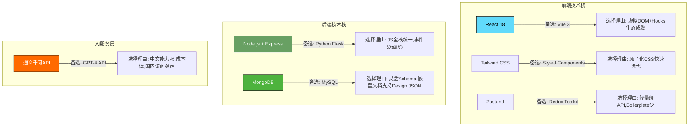
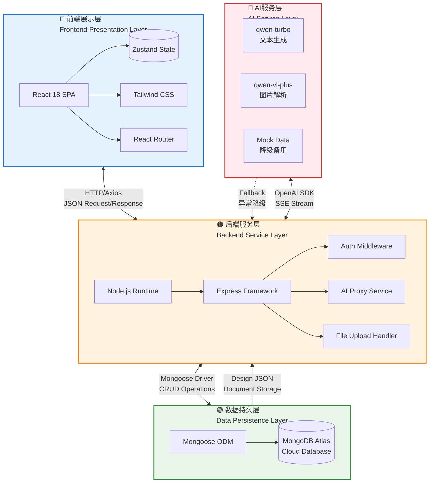

# 第二章 相关技术概述

本章介绍系统涉及的核心技术,重点阐明技术选型的合理性。

## 2.1 分布式/系统架构基础

本系统采用前后端分离的分布式架构模式。前端基于React 18构建单页应用(SPA),通过客户端路由实现页面局部更新,避免传统多页应用的全量刷新问题;后端采用Node.js + Express搭建RESTful API服务层,承担业务逻辑处理与数据编排职责;数据持久化选用MongoDB Atlas云数据库,其文档型模型天然契合Design JSON嵌套树形结构的存储需求\[9]。三层通过JSON格式的HTTP请求/响应交互,JavaScript全栈统一降低了维护成本。

前后端通信接口遵循RESTful架构风格,以资源为核心抽象单元,借助HTTP语义化方法(GET/POST/PUT/DELETE)实现标准化操作。REST的无状态性、统一接口和分层系统三大约束简化了服务端扩展难度,也为API的可预测性提供了保障\[10]。

SPA架构为本系统带来显著优势:模块切换响应近乎即时,有效避免了白屏闪烁;React Router封装浏览器History API支持原生导航控件;Service Worker技术可实现离线缓存策略,在网络不稳定环境下仍能浏览已加载内容\[9]。

***

## 2.2 核心技术栈介绍

### React 18框架特性

React 18是本系统前端核心框架,全面推广函数式组件与Hooks API组合使用,替代传统类组件写法。Hooks机制(如useState、useEffect、useMemo)使状态管理和生命周期逻辑复用更加优雅,Custom Hooks允许将复杂业务逻辑封装为可复用函数单元\[9]。虚拟DOM采用声明式编程范式,Diff算法高效比较前后虚拟DOM树差异并批量执行最小化DOM更新,配合React.memo可避免props未变化时的冗余渲染。React 18引入并发特性(自动批处理、Suspense懒加载),TypeScript集成提供静态类型检查能力,确保Design JSON数据结构在编译阶段即可被校验。

### Node.js + Express后端技术

后端基于Node.js运行时环境构建,选择理由在于JavaScript全栈开发的统一性优势——前后端采用相同语言降低学习成本,npm生态系统丰富模块库加速开发进程。Node.js的事件驱动和非阻塞I/O模型特别适合AI模型调用代理、文件流式传输等I/O密集型任务\[10]。Express框架作为轻量级Web框架,提供清晰的MVC分层结构和中间件扩展机制。在本系统中承担三大职责:用户认证鉴权网关、AI服务代理与编排层(封装通义千问API并提供SSE流式接口)、文件上传处理和数据库CRUD操作执行者。

### MongoDB文档数据库

本系统选用MongoDB作为数据持久化方案,基于NoSQL文档型数据库灵活Schema设计与Design JSON数据结构的自然适配性做出决策。MongoDB采用BSON格式存储数据,每条记录可包含嵌套对象和数组结构,Design JSON多层级的树形组件描述可直接作为完整文档存入数据库,无需像关系型数据库那样拆分为多张表并通过JOIN重组\[11]。相较于MySQL,MongoDB的Schema-less特性允许不同文档拥有不同字段集合,适应Design JSON随功能迭代动态演化的需求;嵌套文档天然支持树形层级关系表达;MongoDB Atlas云托管服务免去了本地运维负担,自动分片和副本集机制保障可用性和水平扩展能力。

### JWT认证机制

系统采用JSON Web Token(JWT)实现无状态用户身份认证。JWT由Header(算法声明)、Payload(用户ID/角色等声明)、Signature(签名防篡改)三部分组成,经Base64编码连接形成完整Token字符串\[12]。核心优势在于无状态性——服务端无需维护Session会话记录,每次请求携带的Token本身即包含完整身份验证信息,极大简化了水平扩展难度。安全策略包括:密码使用bcrypt单向哈希加密存储;Token有效期7天,支持自动续期;敏感操作要求二次确认;Token通过HTTP-only Cookie传递防止XSS攻击窃取。

### Zustand状态管理

前端全局状态管理采用Zustand库,它是Redux的现代轻量级替代方案。设计哲学为极简主义——没有Action/Reducer/Dispatch繁琐模板代码,Store定义即为普通JavaScript函数,状态读写通过自定义Hook直接完成。核心优势在于订阅机制的精细粒度:组件可选择性地仅订阅Store特定字段,仅当被订阅字段变化时才触发重渲染\[13]。在本系统中,Zustand Store维护currentDesignJson(当前编辑的设计数据)、historyList(历史记录列表)、selectedNodeId(当前选中组件ID)等核心状态。系统采用会话分片状态隔离策略——每个浏览器Tab对应独立sessionId,按会话ID分别存储各自设计状态,避免全局状态相互污染。

**表2-1 核心技术栈选型对比表**

| 技术名称 | 备选方案 | 选择理由 | 在本系统中的作用 |
|---------|---------|---------|----------------|
| **React 18** | Vue 3、Angular | 虚拟DOM Diff高效、Hooks生态成熟、TypeScript集成完善 | 构建SPA单页应用,实现Design JSON递归渲染与实时预览 |
| **Tailwind CSS** | Styled Components、Sass | 原子化CSS类名快速编写、JIT编译体积小 | 实现编辑器UI界面样式开发和暗色主题切换 |
| **Zustand** | Redux Toolkit、MobX | API简洁Boilerplate少、Selector精细订阅避免无效渲染 | 维护全局状态(currentDesignJson、historyList等),支持会话分片 |
| **Node.js + Express** | Python Flask、Java Spring Boot | JS全栈统一降低学习成本、事件驱动非阻塞I/O适合高并发 | 搭建RESTful API服务层,承担AI代理、认证鉴权、文件处理职责 |
| **MongoDB** | MySQL、PostgreSQL | Schema灵活适应Design JSON动态结构、嵌套文档天然支持树形存储 | 持久化存储用户信息、历史记录及内嵌的Design JSON文档 |
| **通义千问API** | GPT-4 API、Claude API | 中文理解能力强、成本低、国内访问稳定 | 提供文本/图片到Design JSON的多模态生成能力 |

***

## 2.3 AI与大模型技术

### 大语言模型基本原理

大语言模型(LLM)的技术根基源自Transformer架构\[14],该架构完全基于自注意力机制捕捉输入序列中任意位置元素间的依赖关系,支持并行化训练并能有效建模长距离上下文依赖。现代LLM普遍遵循"大规模预训练+下游任务微调"的两阶段范式:在海规模文本语料上进行自监督学习掌握语言统计规律,再针对特定任务进行监督微调或人类反馈强化学习(RLHF)。随着参数规模扩大,LLM涌现出上下文学习、思维链推理等能力。主流代表包括OpenAI GPT系列、Meta LLaMA系列、Google Gemini系列及阿里通义千问(Qwen)系列等。

### 多模态视觉模型能力

视觉-语言模型(VLM)是大语言模型向多模态感知领域拓展的重要分支,能够同时理解图像与文本两种模态信息。VLM技术路线主要分为两类:一是在已有LLM基础上接入视觉编码器(如CLIP的ViT),将图像特征投影到文本嵌入空间;二是从头开始在图文配对数据上进行联合训练\[15]。在本系统中,VLM应用于"图片转设计稿"功能:用户上传UI设计截图后,系统调用通义千问VL-Plus多模态模型解析图像,提取布局结构信息、UI组件类型及视觉样式属性,并将其结构化映射为符合Design JSON Schema规范的JSON数据,实现了从像素级位图到语义级结构化设计的跨越。

### Prompt工程技术

Prompt工程是指通过精心设计输入给大模型的提示文本,引导其生成高质量输出的技术方法论。有效Prompt设计遵循以下原则:明确角色设定定义模型行为边界和专业领域;清晰任务指令准确描述动作和输出格式约束;示例引导提供高质量输入-输出示例对帮助模型理解任务模式;输出格式约束通过JSON Schema限定回答结构便于程序化解析\[16]。本系统在实践中发展出四段式Prompt结构:系统指令定义AI助手角色定位和输出规范;历史对话上下文注入多轮对话保持语义连贯;当前设计状态注入现有Design JSON实现增量修改;用户指令承载具体需求描述。此外采用思维链引导策略提示模型先分析结构特点、规划修改方案、再输出结果,显著提升复杂修改任务的准确性。

### 通义千问模型简介

通义千问(Qwen)是阿里云推出的大语言模型系列,本系统选用qwen-turbo和qwen-vl-plus两个版本分别处理文本生成和多模态视觉任务。选择该模型的核心考量在于:中文语境下理解和生成能力经过大规模中文语料优化;qwen-turbo提供8K token上下文窗口长度足以容纳中等复杂度Design JSON序列化表示加多轮对话历史;API支持SSE流式输出协议可实时推送至前端;相比GPT-4等国际模型在国内网络环境下访问延迟更低且服务稳定性更有保障\[17]。为确保容错,系统设计了降级策略:当通义千问API无法正常响应时,自动切换至本地Mock数据模式返回预设示例Design JSON,并在前端显示友好提示,保证极端情况下用户仍能体验核心编辑功能。

### 算法微调背景

尽管通用大语言模型具备较强代码生成能力,但直接应用于Design JSON生成任务时仍面临精度不足问题。实验数据显示,未优化基线配置下模型生成的Design JSON存在约40%概率出现字段缺失、类型错误或Schema不规范情况,增量修改准确率仅60%左右。主要原因在于通用模型训练语料缺乏足够数量Design JSON样本数据,对领域特有术语理解不够精确。针对此问题,本系统选择了轻量实用的Prompt Engineering优化路径辅以Few-shot示例引导,而非计算成本高昂的全量参数微调或LoRA低秩适配等方法。通过五轮迭代优化(第五章详细阐述),最终将增量修改准确率提升至82%,Design JSON格式合规率达95%以上,表明精心Prompt设计和少量高质量示例注入可在不改变模型参数前提下显著提升生成质量。

**图2-1 系统技术栈层次图**

图2-1展示了本系统的四层技术栈架构及其数据流向。前端展示层基于React 18构建单页应用,通过Zustand管理全局状态,Tailwind CSS负责原子化样式,React Router实现客户端路由;后端服务层运行于Node.js环境,Express框架提供RESTful API,中间件链负责认证鉴权、AI代理和文件处理;数据持久层采用MongoDB Atlas云数据库;AI服务层对接通义千问双模型(qwen-turbo处理文本,qwen-vl-plus处理图片),并配备本地Mock数据作为降级保障。四层间通过标准化HTTP协议和JSON格式交互,形成松耦合、高内聚的系统架构。
