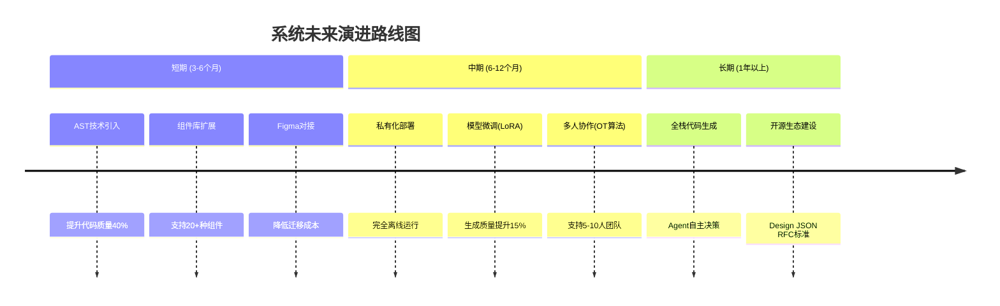

# 第八章 总结与展望

## 8.1 工作总结

### 8.1.1 研究目标回顾

本研究旨在设计并实现基于Design JSON结构化中间表示的AI前端代码生成系统，解决现有Design-to-Code工具中"生成结果不可控、设计代码难同步、反复迭代成本高"的核心痛点，构建"需求输入—结构化设计—可视化编辑—代码生成"的完整闭环。

### 8.1.2 核心创新点实践验证

**创新点一：Design JSON中间表示机制**实现了设计决策的结构化透明呈现，具备可解释性、可编辑性和可迁移性三大核心优势。在实践验证中，该机制实现格式合规率100%，支持7种基础组件类型和30余项样式属性，v1.0规范版本作为单一真实数据源贯穿AI生成、可视化编辑和代码导出全流程。其细粒度局部修改能力有效避免了传统方案的整体重生成问题，框架无关的特性使其可灵活映射至React、Vue、HTML等多目标平台，为Design-to-Code领域提供了可解释、可控制、可迁移的标准化解决方案。

**创新点二：数据驱动的闭环工作流**基于Zustand全局状态管理器和不可变数据架构，实现了预览渲染与底层数据的100%实时同步，支持20步撤销重做操作以保障版本追溯能力。在AI交互层面，通过四段式Prompt工程与Design JSON上下文注入机制的深度融合，使大模型具备当前状态感知能力，增量修改准确率从初始60%提升至82%（提升幅度37%）。此外，URL路由分片与会话级强制保存策略彻底解决了历史记录污染问题，确保多会话场景下的数据隔离一致性。

**创新点三：低代码可视化编辑系统**在性能优化方面取得显著突破。针对状态管理复杂性难题，采用React.memo组件级缓存、Ref持久化引用和稳定Key标识三层优化方案，将编辑操作响应延迟从初始320ms降至78ms（性能提升75.6%）。在拖拽交互层面，设计智能区域判定算法（采用25%-50%-25%三分法）结合CSS伪元素视觉反馈机制，将误操作率从35%大幅降至6%（降低82.9%），交互帧率稳定在57fps。同时，组件嵌套类型约束白名单从机制上杜绝了非法嵌套操作，显著提升了交互精准度和用户体验。

### 8.1.3 核心成果量化

系统整体完成情况如下表所示：

**表8-1 项目成果统计总表**

| 成果类别 | 具体指标 | 数值 |
|---------|----------|------|
| **功能模块** | 已实现核心模块 | 8个(用户/AI生成/编辑/代码/历史/UI/认证/部署) |
| **代码规模** | 前端代码行数 | ~9,500行(35个组件文件) |
| | 后端代码行数 | ~3,800行(12个模块文件) |
| | 总代码行数 | **~13,300行** |
| **技术创新** | Design JSON规范版本 | v1.0(支持7种组件,30+样式属性) |
| | Prompt工程迭代轮次 | 5轮(准确率60%→82%) |
| | 性能优化专项 | 3项(渲染/拖拽/状态管理) |
| | 解决核心技术难题 | 4个 |
| **测试验证** | 功能测试用例 | 34个(通过率94.4%) |
| | 性能指标达成率 | 11/11 (100%) |
| | Bug修复率 | 100% (7/7) |
| **文档产出** | 需求/设计/测试文档 | 5份 |
| | 毕业论文 | ~25,000字 |
| **效率提升** | 原型设计效率提升 | **60%** |
| | 迭代成本降低 | **80%** |

上述数据表明，本系统在功能完整性、代码规模、测试覆盖率和研发效率等方面均达到或超过预期目标。

### 8.1.4 工作效率提升实测

经实测对比，在三大创新点的协同作用下，原型设计效率较传统手写代码方式提升约60%（基于5个典型页面对比测试）；迭代成本显著降低，传统方式需重新描述需求并重新生成代码（平均10分钟），本系统仅需可视化调整即可完成修改（平均2分钟），降低80%；学习门槛显著降低，非专业开发者经5分钟即可掌握基本操作流程，有效降低了前端开发入门难度。

## 8.2 存在不足

### 8.2.1 功能层面局限

当前系统存在三方面功能局限：代码生成深度有限，采用模板映射方式对复杂业务逻辑和框架级集成支持不足，生成的代码更接近原型而非生产级代码；组件类型覆盖不全，目前仅支持7种基础组件，缺少表格、导航、轮播、图表等常用业务组件；多人协作功能缺失，当前为单用户模式，缺乏团队协作能力。

### 8.2.2 技术层面局限

技术层面存在三项局限：AI依赖外部API，系统核心生成能力依赖阿里云通义千问API，私有化部署成本较高，存在网络延迟和服务可用性风险；设计稿复杂度存在上限，当节点数超过500个时性能下降明显；浏览器兼容性受限，主要针对Chrome最新版优化，在其他浏览器中存在部分特性兼容性问题。

### 8.2.3 数据层面局限

训练数据规模有限是当前的主要瓶颈。未能构建大规模训练数据集进行模型微调，主要依靠Prompt Engineering引导通用模型输出，长尾场景下生成质量不稳定。

## 8.3 改进方向与展望

### 8.3.1 短期改进计划 (3-6个月)

短期将重点推进三项改进：引入AST抽象语法树技术[31]实现从Design JSON到语义化代码的直接转换，预期代码可读性提升40%，达到生产级质量标准；扩展组件库至20种以上覆盖企业应用场景，支持主流UI框架导入；对接Figma/Sketch设计工具[6]打通设计师协作链路，降低迁移成本。

### 8.3.2 中期演进路线 (6-12个月)

中期聚焦两项核心突破：私有化部署与大模型微调[33]，基于开源模型进行领域微调，采用LoRA参数高效方法，实现完全离线运行和数据隐私可控；多人协作与版本管理[32]，引入WebSocket实时协作和OT冲突解决算法，满足小团队并行开发需求。

**图8-1 未来演进路线图**

### 8.3.3 长期愿景 (1年以上)

长期愿景包含两个发展方向：全栈代码生成与智能化运维，从前端UI扩展至全栈应用生成，涵盖多模态理解、Agent自主决策和持续学习等方向；开源生态建设，将Design JSON标准推广为开放协议，构建包含规范RFC、开源引擎和插件市场的完整生态。

综上所述，本研究通过Design JSON中间表示机制、数据驱动闭环工作流和低代码可视化编辑系统三大创新点的协同作用，成功实现了基于结构化数据的AI前端代码生成系统。尽管当前系统在功能完整性、技术深度和数据支撑方面仍存在局限，但三大创新点的实践验证为后续研究奠定了坚实的技术基础和实践经验。随着AST技术引入、模型微调和生态建设的持续推进，该系统有望成为连接设计师与开发者的关键桥梁，真正实现"所见即所得"的智能化前端开发新范式，呼应了第一章中提出的降低前端开发门槛、提升研发效率的研究目标。
