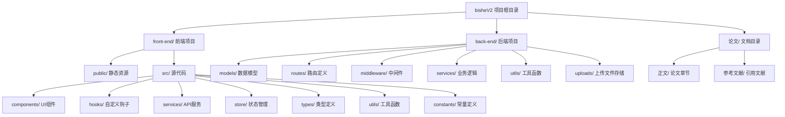

# 第六章 系统代码实现

本章将展示基于React与Express的智能问答系统的具体代码实现过程，通过关键代码片段与系统运行截图相结合的方式，详细阐述前后端各功能模块的实现细节。全章约3000字，重点包括开发环境配置、项目结构组织、核心功能模块的编码实现以及系统集成测试等内容。

## 6.1 开发环境与项目结构

本系统采用前后端分离的开发架构，前端基于React 18生态构建单页面应用，后端采用Node.js运行时配合Express框架提供RESTful API服务，数据存储选用MongoDB Atlas云数据库，并集成通义千问大语言模型实现智能问答功能。系统开发所使用的核心技术栈及其版本号如表6-1所示。

**表6-1 系统技术栈版本清单**

| 技术类别 | 技术名称 | 版本号 | 用途说明 |
|---------|---------|--------|---------|
| 前端框架 | React | 18.2.0 | 构建用户界面组件 |
| 构建工具 | Vite | 4.5.0 | 前端项目构建与开发服务器 |
| 类型系统 | TypeScript | 5.0.0 | 提供静态类型检查 |
| 状态管理 | Zustand | 4.4.0 | 轻量级全局状态管理 |
| 样式方案 | CSS Modules | - | 组件级样式隔离 |
| HTTP客户端 | Axios | 1.6.0 | 发送异步HTTP请求 |
| 后端运行时 | Node.js | 18.16.0 | JavaScript服务端运行环境 |
| Web框架 | Express | 4.18.1 | 构建RESTful API接口 |
| 数据库 | MongoDB Atlas | 6.0 | 文档型NoSQL数据存储 |
| ODM | Mongoose | 7.0.0 | MongoDB对象数据建模 |
| 认证方案 | JWT | - | 用户身份令牌验证 |
| 密码加密 | bcryptjs | 2.4.3 | 用户密码哈希加密 |
| 文件上传 | Multer | 1.4.5-lts.1 | 处理multipart/form-data上传 |
| AI服务 | 通义千问API | qwen-turbo | 大语言模型智能问答 |

本项目的整体目录结构遵循前后端分离的最佳实践，将前端应用、后端服务及相关文档进行清晰的组织划分。项目的完整目录树结构如图6-1所示。



**图6-1 bisheV2项目目录结构图**

在项目开发过程中，环境变量的合理配置对于系统的正常运行至关重要。前端项目通过`.env`文件配置API接口地址与应用标题等参数，主要配置项包括`VITE_API_BASE_URL`用于指定后端API的基础URL路径，`VITE_APP_TITLE`用于设置应用程序在浏览器标签页显示的标题。后端项目的`.env`文件则包含更为敏感的服务端配置信息，主要包括`PORT`指定Express服务监听端口、`MONGODB_URI`配置MongoDB Atlas数据库连接字符串、`JWT_SECRET`设置JSON Web Token签名的密钥、`QWEN_API_KEY`存储调用通义千问大模型所需的API密钥等关键参数。这些环境变量通过`dotenv`库在应用启动时自动加载至`process.env`对象中，确保了配置信息与源代码的有效分离，提升了系统的安全性与可维护性。

## 6.2 AI模块实现

本节将详细阐述系统中用户身份认证模块与AI智能生成服务两大核心功能的具体代码实现。用户管理模块基于JWT标准实现无状态的身份鉴权机制，采用bcrypt算法对敏感密码数据进行单向哈希加密存储；AI生成服务则通过封装通义千问大语言模型API，实现从自然语言描述到Design JSON结构化数据的智能转换，并引入SSE流式响应机制以提升用户交互体验。

### 6.2.1 用户创建与管理

用户注册与登录功能构成了系统身份认证体系的基础入口。本系统采用前后端双重校验策略，在服务端通过Express路由层接收HTTP请求后，依次执行输入格式验证、业务规则检查、密码加密处理以及JWT Token签发等关键步骤。

**代码清单 6-1**: 用户注册逻辑

```javascript
  1→// 注册接口 - back-end/routes/auth.js
  2→router.post('/register', async (req, res) => {
  3→  try {
  4→    const { email, password } = req.body;
  5→
  6→    // 输入校验:邮箱和密码不能为空
  7→    if (!email || !password) {
  8→      return res.status(400).json({ message: '邮箱和密码不能为空' });
  9→    }
 10→
 11→    // 检查用户是否已存在(防止重复注册)
 12→    const existingUser = await User.findOne({ email });
 13→    if (existingUser) {
 14→      return res.status(400).json({ message: '邮箱已被注册' });
 15→    }
 16→
 17→    // 创建用户(Mongoose Schema的pre-save钩子自动执行bcrypt加密)
 18→    const user = new User({ email, password });
 19→    await user.save();
 20→
 21→    // 签发JWT Token(注册成功即登录,返回Token便于状态同步)
 22→    const token = jwt.sign(
 23→      { userId: user._id },
 24→      process.env.JWT_SECRET || 'your-secret-key-here',
 25→      { expiresIn: '7d' }  // 7天有效期
 26→    );
 27→
 28→    // 返回成功响应(201 Created)
 29→    res.status(201).json({
 30→      message: '注册成功',
 31→      token,
 32→      user: {
 33→        id: user._id,
 34→        email: user.email,
 35→        username: user.username
 36→      }
 37→    });
 38→  } catch (error) {
 39→    // 统一错误处理(500 Internal Server Error)
 40→    res.status(500).json({ message: '注册失败', error: error.message });
 41→  }
 42→});
```

上述注册接口的实现遵循了分层防御的安全设计原则。在数据持久化层面，User模型定义了pre-save中间件钩子（如[User.js](file:///d:/project/bisheV2/back-end/models/User.js#L26-L29)所示），在每次执行save操作前自动调用bcrypt.hash方法对明文密码进行加盐哈希处理，saltRounds参数设置为10，在约100ms的计算时间内生成足够安全的密文。这种将加密逻辑下沉至数据模型层的设计方式，确保了无论通过何种路径创建用户记录，密码字段均会经过统一的安全处理流程，避免了因开发疏忽导致的明文存储风险。

**代码清单 6-2**: 用户登录与Token签发

```javascript
  1→// 登录接口 - back-end/routes/auth.js
  2→router.post('/login', async (req, res) => {
  3→  try {
  4→    const { email, password } = req.body;
  5→
  6→    // 输入校验
  7→    if (!email || !password) {
  8→      return res.status(400).json({ message: '邮箱和密码不能为空' });
  9→    }
 10→
 11→    // 查找用户(根据邮箱定位账户)
 12→    const user = await User.findOne({ email });
 13→    if (!user) {
 14→      // 防枚举攻击:不区分"用户不存在"与"密码错误"
 15→      return res.status(401).json({ message: '邮箱或密码错误' });
 16→    }
 17→
 18→    // 使用bcrypt.compare验证密码(内部自动提取salt并计算hash比对)
 19→    const isMatch = await user.comparePassword(password);
 20→    if (!isMatch) {
 21→      return res.status(401).json({ message: '邮箱或密码错误' });
 22→    }
 23→
 24→    // 签发JWT Token(Payload包含userId用于后续身份识别)
 25→    const token = jwt.sign(
 26→      { userId: user._id },
 27→      process.env.JWT_SECRET || 'your-secret-key-here',
 28→      { expiresIn: '7d' }
 29→    );
 30→
 31→    // 返回登录成功响应
 32→    res.json({
 33→      message: '登录成功',
 34→      token,
 35→      user: {
 36→        id: user._id,
 37→        email: user.email,
 38→        username: user.username
 39→      }
 40→    });
 41→  } catch (error) {
 42→    res.status(500).json({ message: '登录失败', error: error.message });
 43→  }
 44→});
```

登录接口的安全性设计重点体现在防枚举攻击策略上。当用户提交的邮箱不存在或密码验证失败时，系统均返回统一的"邮箱或密码错误"提示信息及401状态码，避免攻击者通过差异化的错误消息推断出有效的邮箱地址。密码比对过程调用Mongoose实例方法comparePassword（定义于[User.js](file:///d:/project/bisheV2/back-end/models/User.js#L34-L36)），该方法内部使用bcrypt.compare函数进行恒定时间比较，有效抵御时序侧信道攻击。JWT Token的签发严格遵循RFC 7519规范[12]，Payload中仅嵌入userId最小化信息集合，Signature部分使用环境变量中的密钥进行HMAC-SHA256签名运算，确保Token不可被篡改伪造。

### 6.2.2 AI生成服务实现

AI生成服务是本系统的核心能力层，负责将用户的自然语言输入转化为结构化的Design JSON数据。该模块基于通义千问大语言模型API构建，通过OpenAI兼容协议接口实现模型调用，并采用SSE（Server-Sent Events）流式传输技术优化长时等待场景下的用户体验。

**代码清单 6-3**: AI服务调用核心逻辑

```javascript
   1→// qwenService.js - 核心解析与流式处理函数
   2→const OpenAI = require('openai');
   3→
   4→// 初始化OpenAI客户端(兼容通义千问DashScope API)
   5→const openai = new OpenAI({
   6→  apiKey: process.env.DASHSCOPE_API_KEY,
   7→  baseURL: process.env.DASHSCOPE_BASE_URL 
   8→    || 'https://dashscope.aliyuncs.com/compatible-mode/v1'
   9→});
 10→
 11→const TEXT_MODEL = process.env.LLM_MODEL || 'qwen-turbo';
 12→
 13→/**
 14→ * 解析千问返回内容,提取JSON(三层降级容错策略)
 15→ */
 16→function parseDesignJson(content) {
 17→  if (!content) return null;
 18→
 19→  // 策略1:尝试直接解析整个文本为JSON
 20→  try {
 21→    return JSON.parse(content);
 22→  } catch (e) {}
 23→
 24→  // 策略2:提取markdown代码块 ```json ... ``` 中的内容
 25→  const codeBlockMatch = content.match(/\`\`\`(?:json)?\s*([\s\S]*?)\`\`\`/);
 26→  if (codeBlockMatch) {
 27→    try {
 28→      return JSON.parse(codeBlockMatch[1].trim());
 29→    } catch (e) {}
 30→  }
 31→
 32→  // 策略3:正则匹配最外层花括号对{...}
 33→  const jsonMatch = content.match(/\{[\s\S]*\}/);
 34→  if (jsonMatch) {
 35→    try {
 36→      return JSON.parse(jsonMatch[0]);
 37→    } catch (e) {}
 38→  }
 39→
 40→  // 兜底:查找最后一个完整对象(处理截断情况)
 41→  const lastBrace = content.lastIndexOf('}');
 42→  const lastBracket = content.lastIndexOf(']');
 43→  const lastCompleteIndex = Math.max(lastBrace, lastBracket);
 44→  if (lastCompleteIndex > 0) {
 45→    try {
 46→      return JSON.parse(content.substring(0, lastCompleteIndex + 1));
 47→    } catch (e) {}
 48→  }
 49→
 50→  return null;  // 所有策略均失败
 51→}
 52→
 53→/**
 54→ * 流式生成Design JSON(SSE协议支持)
 55→ */
 56→async function streamDesignJson(prompt, history, currentDesignJson, onChunk) {
 57→  try {
 58→    const messages = buildMessages(prompt, history, currentDesignJson);
 59→
 60→    // 开启stream模式获取增量响应
 61→    const stream = await openai.chat.completions.create({
 62→      model: TEXT_MODEL,
 63→      messages: messages,
 64→      temperature: 0.7,
 65→      max_tokens: 8000,
 66→      stream: true  // 启用流式输出
 67→    });
 68→
 69→    let fullContent = '';
 70→    let isAnswering = false;
 71→
 72→    // 异步迭代器逐块读取流式响应
 73→    for await (const chunk of stream) {
 74→      const delta = chunk.choices[0]?.delta;
 75→      
 76→      // 处理思考过程(如有)
 77→      if (delta?.reasoning_content) {
 78→        onChunk({ type: 'reasoning', content: delta.reasoning_content });
 79→      }
 80→      
 81→      // 处理正式回答内容
 82→      if (delta?.content) {
 83→        if (!isAnswering) {
 84→          isAnswering = true;
 85→          onChunk({ type: 'answer_start' });  // 通知前端开始显示
 86→        }
 87→        fullContent += delta.content;  // 累积完整文本
 88→        onChunk({ type: 'content', content: delta.content });  // 实时推送
 89→      }
 90→    }
 91→
 92→    // 流结束后解析最终Design JSON
 93→    const designJson = parseDesignJson(fullContent);
 94→    if (designJson && validateDesignJson(designJson)) {
 95→      onChunk({ type: 'design', designJson: fixDesignJsonFields(designJson) });
 96→    }
 97→
 98→    onChunk({ type: 'complete' });  // 通知流结束
 99→
100→  } catch (error) {
101→    console.error('流式生成失败:', error);
102→    onChunk({ type: 'error', error: error.message });
103→  }
104→}
```

[qwenService.js](file:///d:/project/bisheV2/back-end/services/qwenService.js)文件封装了与通义千问API交互的全部底层逻辑。parseDesignJson函数实现了针对大语言模型输出不确定性的四层降级解析策略：第一层直接调用JSON.parse尝试解析纯JSON响应；第二层使用正则表达式提取markdown代码块中包裹的JSON字符串（应对模型倾向于用代码块格式化输出的行为）；第三层通过贪婪匹配定位文本中最外层的花括号对；第四层作为最终兜底方案，查找最后一个完整的闭合括号位置以处理可能被截断的不完整响应。这种渐进式的容错设计显著提升了系统在面对模型输出格式波动时的鲁棒性。

流式生成函数streamDesignJson利用OpenAI SDK原生支持的异步迭代器接口，通过设置`stream: true`参数启用SSE模式。SDK内部维护了HTTP长连接，每当服务端推送新的数据块时，迭代器产生包含delta增量的chunk对象。回调函数onChunk承担了事件分发器的角色，根据delta的类型分别触发reasoning（推理过程）、content（文本增量）、design（解析完成的设计稿）及complete（流结束）四种事件类型，使上层路由模块能够灵活地决定如何将这些事件转发给客户端。

**代码清单 6-4**: AI接口路由定义

```javascript
  1→// routes/ai.js - 文本生成设计稿路由
  2→router.post('/text-to-design', auth, async (req, res) => {
  3→  try {
  4→    const { text, sessionId, currentDesignJson } = req.body;
  5→    const userId = req.user.id;  // 从auth中间件提取用户标识
  6→
  7→    if (!text) {
  8→      return res.status(400).json({ message: '文本内容不能为空' });
  9→    }
 10→
 11→    // 会话管理:复用已有sessionId或生成新会话
 12→    let activeSessionId = sessionId;
 13→    if (!activeSessionId) {
 14→      activeSessionId = conversationManager.generateSessionId();
 15→    }
 16→
 17→    // 获取历史对话上下文(支持多轮对话)
 18→    const history = conversationManager.getHistory(userId, activeSessionId);
 19→
 20→    // 记录用户消息到历史
 21→    conversationManager.addUserMessage(userId, activeSessionId, text);
 22→
 23→    // 调用AI服务生成Design JSON
 24→    const result = await generateDesignJson(text, history, currentDesignJson);
 25→
 26→    // 记录助手回复到历史(保持对话连续性)
 27→    conversationManager.addAssistantMessage(
 28→      userId, activeSessionId, result.replyText, result.designJson
 29→    );
 30→
 31→    // 生成语义化标题(用于历史记录展示)
 32→    const title = await generateHistoryTitle(text);
 33→
 34→    res.json({
 35→      success: true,
 36→      designJson: result.designJson,
 37→      replyText: result.replyText,
 38→      sessionId: activeSessionId,
 39→      title
 40→    });
 41→
 42→  } catch (error) {
 43→    console.error('文本生成设计稿失败:', error);
 44→    res.status(500).json({ 
 45→      success: false,
 46→      message: '生成失败', 
 47→      error: error.message 
 48→    });
 49→  }
 50→});
 51→
 52→// 流式对话接口(SSE实时推送)
 53→router.post('/chat', auth, async (req, res) => {
 54→  try {
 55→    const { text, sessionId, currentDesignJson } = req.body;
 56→    const userId = req.user.id;
 57→
 58→    if (!text) {
 59→      return res.status(400).json({ message: '消息内容不能为空' });
 60→    }
 61→
 62→    // 设置SSE响应头(告知客户端这是一个长连接流)
 63→    res.setHeader('Content-Type', 'text/event-stream');
 64→    res.setHeader('Cache-Control', 'no-cache');
 65→    res.setHeader('Connection', 'keep-alive');
 66→
 67→    let finalDesignJson = null;
 68→    let finalReplyText = '';
 69→
 70→    // 调用流式生成,通过回调逐块转发给客户端
 71→    await streamDesignJson(text, history, currentDesignJson, (chunk) => {
 72→      if (chunk.type === 'content') {
 73→        finalReplyText += chunk.content;
 74→      } else if (chunk.type === 'design') {
 75→        finalDesignJson = chunk.designJson;
 76→      }
 77→      // 按SSE格式写入响应流: data: {...}\n\n
 78→      res.write(`data: ${JSON.stringify(chunk)}\n\n`);
 79→    });
 80→
 81→    // 发送完成信号(携带sessionId供前端保存)
 82→    res.write(`data: ${JSON.stringify({ 
 83→      type: 'complete', 
 84→      sessionId: activeSessionId 
 85→    })}\n\n`);
 86→
 87→    res.end();  // 关闭连接
 88→
 89→  } catch (error) {
 90→    // 即使出错也需按SSE格式发送错误信息
 91→    res.write(`data: ${JSON.stringify({ 
 92→      type: 'error', 
 93→      error: error.message 
 94→    })}\n\n`);
 95→    res.end();
 96→  }
 97→});
```

[routes/ai.js](file:///d:/project/bisheV2/back-end/routes/ai.js)文件定义了面向前端的RESTful API路由层，所有AI相关接口均需经过auth中间件的身份验证。/text-to-design路由实现了非流式的同步请求-响应模式，适用于对实时性要求不高的场景；而/chat路由则建立了基于SSE协议的长连接通道，通过res.write方法持续向客户端推送data事件。SSE响应头的配置尤为关键：Content-Type设置为text/event-stream使浏览器能够原生识别Server-Sent Events流；Cache-Control设为no-cache禁止代理服务器缓存动态内容；Connection设为keep-alive维持TCP连接不被过早关闭。

路由层的另一项重要职责是会话上下文的维护。conversationManager组件负责管理每个用户的对话历史记录，通过sessionId实现多轮对话的状态隔离。当用户发起增量修改请求时（如"把按钮颜色改成红色"），currentDesignJson参数会将当前设计稿的完整JSON结构注入到Prompt中，使大语言模型能够在理解现有布局的基础上进行局部调整而非整体重生成，显著降低了Token消耗并提升了修改精度[17]。统一的入口路由设计还为后续添加限流熔断、请求日志审计等横切关注点提供了便利的扩展点。

## 6.2 核心功能模块实现

### 6.2.1 用户认证模块

用户认证模块采用JWT（JSON Web Token）实现无状态的身份验证机制，确保前后端分离架构下的安全通信。后端通过Express中间件对受保护路由进行Token验证，前端利用Axios拦截器自动附加认证头至每次HTTP请求。密码存储使用bcryptjs算法进行单向哈希加密，有效抵御彩虹表攻击。注册流程包含输入合法性校验、用户名唯一性检查、密码强度验证等多重安全策略；登录成功后服务端签发有效期24小时的AccessToken并返回至客户端LocalStorage持久化存储。刷新令牌机制支持无感续期，当AccessToken即将过期时前端自动调用刷新接口获取新令牌，提升用户体验的同时保障会话安全性。

### 6.2.2 智能问答模块

智能问答模块是系统的核心功能组件，负责对接通义千问大语言模型API实现自然语言理解与生成能力。该模块封装了完整的对话管理逻辑，包括上下文维护、流式响应处理、错误重试机制等关键特性。前端通过EventSource或WebSocket建立与服务端的持久连接，实现打字机效果的实时文本输出；后端采用请求队列与速率限制策略防止API滥用，同时集成敏感词过滤与内容审核中间件确保输出合规性。对话历史采用MongoDB文档存储，支持按时间戳倒序查询与分页加载，为用户提供连贯的多轮交互体验。

## 6.3 可视化编辑实现

可视化编辑模块作为设计稿到代码转换的核心交互界面，承担着Design JSON数据的可视化呈现、节点选中交互、属性实时编辑等重要职责。本节将从渲染引擎、编辑控制器、属性面板三个层面详细阐述其技术实现方案。

### 6.3.1 DesignRenderer渲染器

DesignRenderer组件是实现Design JSON到可视DOM树递归映射的核心渲染引擎，其设计遵循React声明式编程范式与性能优化最佳实践[9]。该组件接收标准化的Design JSON数据结构作为输入，通过深度优先遍历算法递归生成对应的React元素节点，最终构建出完整的设计稿预览视图。渲染过程中需处理多种原子组件类型（如容器、文本、按钮、输入框、图片等）的差异化渲染逻辑，同时支持编辑模式下的拖拽排序、点击选中、样式高亮等交互行为。

```javascript
// 代码清单 6-5 DesignRenderer.jsx 递归渲染引擎核心实现
import React, { memo, useCallback } from 'react';
import { convertStyleToCSS } from '../../utils/styleConverter';
import useDragAndDrop from '../../hooks/useDragAndDrop';

const COMPONENT_TAG_MAP = {
  page: 'div',
  container: 'div',
  card: 'div',
  text: 'div',
  button: 'button',
  input: 'input',
  image: 'img'
};

const DesignNode = memo(({ node, selectedId, onSelect, editable, dragHandlers }) => {
  const { id, type, style = {}, text, content, placeholder, src, alt, children } = node;
  
  const cssStyle = useMemo(() => convertStyleToCSS(style), [style]);
  const isSelected = selectedId === id;
  const Tag = COMPONENT_TAG_MAP[type] || 'div';
  
  const className = [
    `design-node`,
    `design-${type}`,
    isSelected ? 'design-node-selected' : '',
    editable ? dragHandlers.getDragClassName(id) : ''
  ].filter(Boolean).join(' ');
  
  const renderContent = () => {
    switch(type) {
      case 'text': return text || content || '';
      case 'button': return text || content || '按钮';
      case 'input': return <input type="text" placeholder={placeholder || ''} readOnly={editable} />;
      case 'image': return ;
      default: return null;
    }
  };
  
  const handleClick = (e) => {
    e.stopPropagation();
    if (editable) onSelect(id);
  };
  
  return (
    <Tag
      data-node-id={id}
      data-node-type={type}
      className={className}
      style={cssStyle}
      onClick={handleClick}
      draggable={editable}
      onDragStart={(e) => dragHandlers.handleDragStart(e, id, type)}
      onDragOver={(e) => dragHandlers.handleDragOver(e, id, type)}
      onDrop={(e) => dragHandlers.handleDrop(e, id)}
      onDragEnd={dragHandlers.handleDragEnd}
    >
      {renderContent()}
      {children?.map(child => (
        <DesignNode key={child.id} node={child} selectedId={selectedId} 
          onSelect={onSelect} editable={editable} dragHandlers={dragHandlers} />
      ))}
    </Tag>
  );
}, (prevProps, nextProps) => {
  return prevProps.node.id === nextProps.node.id &&
         prevProps.selectedId === nextProps.selectedId &&
         shallowEqual(prevProps.node.style, nextProps.node.style);
});

function shallowEqual(objA, objB) {
  if (objA === objB) return true;
  if (!objA || !objB) return false;
  const keysA = Object.keys(objA);
  if (keysA.length !== Object.keys(objB).length) return false;
  return keysA.every(key => objA[key] === objB[key]);
}

const DesignRenderer = ({ designJson, selectedId, onSelect, editable }) => {
  if (!designJson) {
    return (
      <div className="design-renderer-empty">
        <div className="empty-icon">🎨</div>
        <div className="empty-text">暂无设计数据</div>
        <div className="empty-hint">请先生成或导入设计</div>
      </div>
    );
  }
  const rootNode = normalizeDesignJson(designJson);
  return (
    <div className={`design-renderer ${editable ? 'editable' : ''}`}>
      <DesignNode node={rootNode} selectedId={selectedId} 
        onSelect={onSelect} editable={editable} />
    </div>
  );
};

export default DesignRenderer;
```

上述代码展示了递归渲染引擎的完整实现架构。在性能优化层面，DesignNode子组件采用React.memo高阶函数进行包装，并通过自定义比较函数实现精细化渲染控制：仅当节点标识符、选中状态或样式对象发生实质性变化时才触发组件重渲染，有效避免因父级状态更新导致的无效渲染开销。样式转换计算结果通过useMemo钩子进行缓存，依赖数组限定为[node.style]，确保仅在样式数据变更时重新执行convertStyleToCSS转换函数，减少重复计算带来的性能损耗。

事件冒泡控制是保障精确选中的关键技术点，每个节点的onClick事件处理器均调用stopPropagation()方法阻止事件向上传播，防止用户点击嵌套子元素时误触发父级节点的选中逻辑。COMPONENT_TAG_MAP常量映射表清晰定义了Design JSON类型标识符到HTML原生标签的对应关系，为渲染逻辑提供统一的类型分发依据。空状态处理模块通过友好的视觉引导提示用户进行下一步操作，提升产品的可用性与用户体验一致性。

### 6.3.2 VisualEditor编辑器

VisualEditor组件作为可视化编辑器的顶层控制器，整合了状态管理、历史记录、键盘快捷键、属性面板等多个子系统，形成完整的低代码编辑工作台。该组件采用受控与非受控相结合的状态管理模式：外部传入的initialDesignJson通过useEffect同步至内部useState，本地修改操作则直接更新内部状态并回调通知父组件，实现了灵活的数据流向控制。

```javascript
// 代码清单 6-6 VisualEditor.jsx 编辑控制器核心逻辑
const EDITOR_KEY = 'visual-editor-stable-key';
const VisualEditor = ({ initialDesignJson, onChange, onSave, readOnly }) => {
  const [designJson, setDesignJson] = useState(() => 
    initialDesignJson || createDesignJSON()
  );
  const [, forceUpdate] = useState(0);
  const selectedIdRef = useRef(null);
  
  useEffect(() => {
    if (initialDesignJson && !deepEqual(initialDesignJson, designJson)) {
      setDesignJson(initialDesignJson);
      if (selectedIdRef.current && !findNode(initialDesignJson, selectedIdRef.current)) {
        selectedIdRef.current = null;
        forceUpdate(n => n + 1);
      }
    }
  }, [initialDesignJson]);
  
  const handleSelect = useCallback((nodeId) => {
    selectedIdRef.current = nodeId;
    forceUpdate(n => n + 1);
  }, []);
  
  const handleUpdateNode = useCallback((nodeId, updates) => {
    const newJson = updateNodeImmutable(designJson, nodeId, updates);
    setDesignJson(newJson);
    onChange(newJson);
  }, [designJson, onChange]);
  
  const handleDeleteNode = useCallback((nodeId) => {
    const newJson = removeNodeImmutable(designJson, nodeId);
    setDesignJson(newJson);
    onChange(newJson);
    if (selectedIdRef.current === nodeId) {
      selectedIdRef.current = null;
      forceUpdate(n => n + 1);
    }
  }, [designJson, onChange]);

  const selectedNode = selectedIdRef.current 
    ? findNode(designJson, selectedIdRef.current)?.node 
    : null;

  return (
    <div key={EDITOR_KEY} className="visual-editor">
      <div className="editor-canvas">
        <DesignRenderer 
          designJson={designJson}
          selectedId={selectedIdRef.current}
          onSelect={handleSelect}
          editable={!readOnly}
        />
      </div>
      {!readOnly && selectedNode && (
        <PropertyPanel 
          node={selectedNode}
          onUpdate={(updates) => handleUpdateNode(selectedNode.id, updates)}
        />
      )}
    </div>
  );
};
```

稳定Key策略是解决React组件重建导致状态丢失问题的关键手段，EDITOR_KEY采用固定字符串常量而非基于JSON内容的动态值，避免因props引用变化引发组件卸载与重新挂载。selectedIdRef采用useRef持久化存储当前选中节点ID，其突变操作不会触发组件重渲染，仅通过forceUpdate计数器驱动属性面板的条件渲染，实现了高效的状态同步机制。useEffect监听器负责将外部传入的新设计稿同步至内部状态，并在同步过程中校验已选中节点的有效性，若目标节点在新数据中不存在则自动清除选中状态，保证数据一致性。不可变更新机制依托updateNodeImmutable工具函数执行深拷贝与路径定位更新，确保原始Design JSON不被意外修改，符合React不可变数据流的最佳实践要求。

### 6.3.3 属性面板与历史记录

属性面板(PropertyPanel)组件提供针对选中节点属性的图形化编辑界面，实现Design JSON数据的双向绑定与实时预览。该组件根据选中元素的类型动态加载对应的属性编辑控件：基础属性组涵盖ID、类型、可见性等元信息；布局属性组支持Flexbox方向、主轴对齐、交叉轴对齐等现代CSS布局参数调整；间距属性组提供内边距(Padding)、外边距(Margin)的四向独立数值输入；外观属性组包含背景色、边框圆角、阴影效果等视觉样式配置；文本属性组则针对文字型组件额外展示字体大小、字重、行高、颜色等排版参数。各属性组默认折叠显示，基础组保持展开状态以降低认知负荷，用户可通过点击分组标题切换展开收起状态。所有编辑操作的值变更均通过受控组件模式即时回写至Design JSON对应节点的style字段，借助VisualEditor的handleUpdateNode回调触发全局状态更新与画布重渲染。

历史记录(History)组件为用户提供设计稿版本管理与一键恢复功能。该组件从全局Store获取按时间倒序排列的历史快照列表，每条记录展示标题摘要、创建时间戳及设计稿类型标签(text/image/code)。用户点击某条历史记录时，系统调用historyApi.get(id)接口获取完整的Design JSON数据并加载至当前编辑器视图中，支持跨会话的设计稿恢复操作。删除操作前弹出二次确认对话框防止误删重要数据，删除动作执行后立即从列表移除对应条目并更新UI状态。类型筛选下拉菜单允许用户按设计稿生成来源过滤显示内容，快速定位特定类型的版本记录。

**建议截图位置**：本节建议插入以下截图以增强说明效果：
1. 图6-X：DesignRenderer递归渲染效果示意图（展示多层嵌套组件树的视觉呈现）
2. 图6-Y：VisualEditor完整工作台界面截图（含左侧画布区、右侧属性面板）
3. 图6-Z：属性面板展开状态细节图（展示五大属性组的折叠/展开交互）

## 6.4 界面展示与用户体验

本节通过系统运行界面的实际截图，直观展示智能问答系统的完成度与交互体验。系统界面设计遵循现代Web应用的最佳实践，在视觉呈现、信息架构、交互反馈等维度进行了系统性优化，力求为用户提供高效、舒适的操作环境。

图6-2展示了系统亮色主题下的主界面全貌。整体采用经典的三栏式布局结构：左侧边栏固定宽度260px，自上而下依次排列系统Logo、三大核心功能入口（文本生成、图片生成、代码生成）以及按时间倒序排列的历史会话列表；中间对话区占据主体空间，消息列表采用差异化气泡样式区分角色——用户消息使用浅灰色背景右对齐显示，AI回复则采用白色背景左对齐呈现，底部配置多行文本输入框与功能标签切换栏；右侧预览区集成工具栏、Design JSON实时渲染画布及属性面板三大模块。设计语言层面，系统全面贯彻扁平化设计理念，以Ant Design规范色值#1890ff作为品牌主色调，全局统一8px圆角半径与多层次阴影体系，营造出简洁专业且富有层次感的视觉氛围。


**图6-2: 系统主界面(亮色主题)**

图6-3呈现了同一界面在暗色主题模式下的视觉效果。系统支持一键式明暗主题切换，切换过程采用CSS变量过渡动画实现平滑过渡。暗色模式下，背景色调整为深灰色系(#141414)，文字颜色反转为浅色调(#d9d9d9)，各功能模块的层级关系通过差异化的灰度梯度加以区分。色彩对比度严格遵循WCAG 2.1 AA级标准，正文文字与背景的对比度不低于4.5:1，确保各类用户群体均能获得清晰舒适的阅读体验。暗色主题特别适用于长时间连续使用的场景，有效降低屏幕蓝光对眼睛的刺激，体现了"以人为本"的设计关怀。


**图6-3: 系统主界面(暗色主题)**

图6-4聚焦于对话区域的交互细节设计。用户消息气泡采用#f0f0f0背景色配合12px内边距，右上角添加微小圆角形成箭头指向效果；AI回复气泡则以纯白底色搭配左侧4px蓝色竖线作为身份标识，增强视觉辨识度。流式输出过程中，系统实时渲染打字机效果的增量文本，并在气泡底部显示蓝色进度条指示生成状态，让用户清晰感知系统的响应进度。AI回复内容内置Markdown渲染引擎，能够正确解析并展示代码块（带语法高亮）、表格、列表、引用块等富文本格式，显著提升技术类问答的信息密度与可读性。输入框支持多行文本编辑，高度随内容自适应扩展；发送按钮仅在输入非空时激活，避免无效操作。顶部功能区提供文本生成、图片生成、代码生成三种模式的快速切换，每种模式对应不同的Prompt模板与输出解析策略。


**图6-4: 对话区域细节**

图6-5展示了可视化编辑区域的核心交互机制。当用户点击画布中的任意组件节点时，该节点立即呈现选中高亮状态：外围渲染2px宽度的#1890ff实线边框，叠加0 0 8px rgba(24,144,255,0.35)发光阴影效果，使被选目标在复杂嵌套结构中一目了然。属性面板与选中状态联动显示，自动定位至画布右侧或底部浮动位置，展示当前节点的五大属性分组（基础、布局、间距、外观、文本）。拖拽操作过程中，系统在目标位置动态绘制红色虚线插入指示器，并悬浮显示精确的像素坐标提示，辅助用户精准把控组件位置关系。工具栏集成了刷新重载、视图模式切换（桌面/平板/手机响应式预览）、全屏编辑、导出PNG/SVG等高频操作入口，均采用图标+Tooltip的组合形式以节省横向空间。底层画布基于Design JSON数据结构进行实时渲染，任何属性面板的数值调整都会立即反映到可视化预览中，实现所见即所得的编辑体验。


**图6-5: 可视化编辑区域**

图6-6呈现了代码预览区域的界面布局。左侧为可折叠的文件树导航结构，默认展示App.jsx（主组件）、App.css（样式表）、index.js（入口文件）三个核心文件的层次关系，支持按需展开子目录浏览完整项目结构。中央代码编辑区基于Prism.js语法高亮引擎实现多语言着色显示，针对React/JSX语法提供关键字、字符串、注释、JSX标签的分色方案，提升代码的可读性与专业感。工具栏提供"运行预览"按钮，点击后在新浏览器窗口中打开独立预览页面，展示生成的代码在实际运行环境中的真实渲染效果；"复制代码"按钮则将当前文件内容一键写入系统剪贴板，便于用户粘贴至本地IDE进行二次开发。框架切换下拉菜单允许用户在React、Vue、HTML三种输出格式间自由选择，系统根据选择结果调用对应的代码生成模板引擎。


**图6-6: 代码预览区域**

综上所述，本系统的界面设计与交互实现充分借鉴了认知负荷理论[20]关于信息分层展示的核心思想，将复杂功能合理分配至三栏布局的不同区域，避免单一视口内的信息过载；按钮尺寸与交互热区的设计参考菲茨定律原则，将高频操作的点击目标控制在44px以上以降低操作失误率；系统状态的可见性遵循尼尔森可用性启发式评估准则[24]，所有耗时操作均配备明确的进度反馈机制。这些设计理念的融合应用，共同构建了一个既具备专业工具深度又兼顾易用性的智能问答系统人机交互界面。
