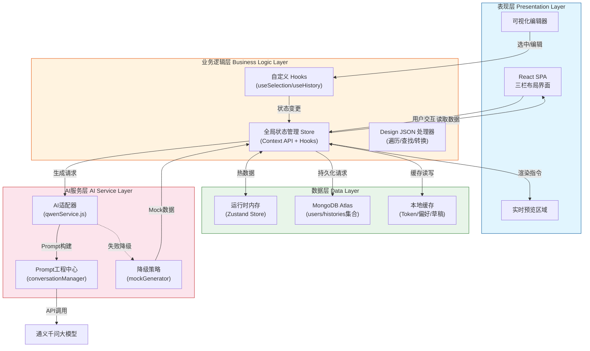
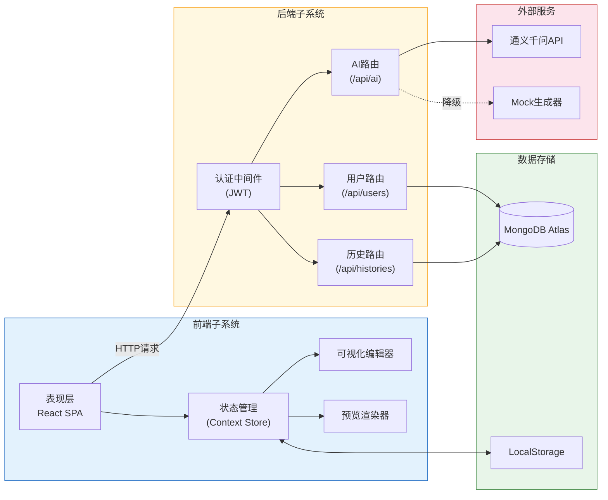
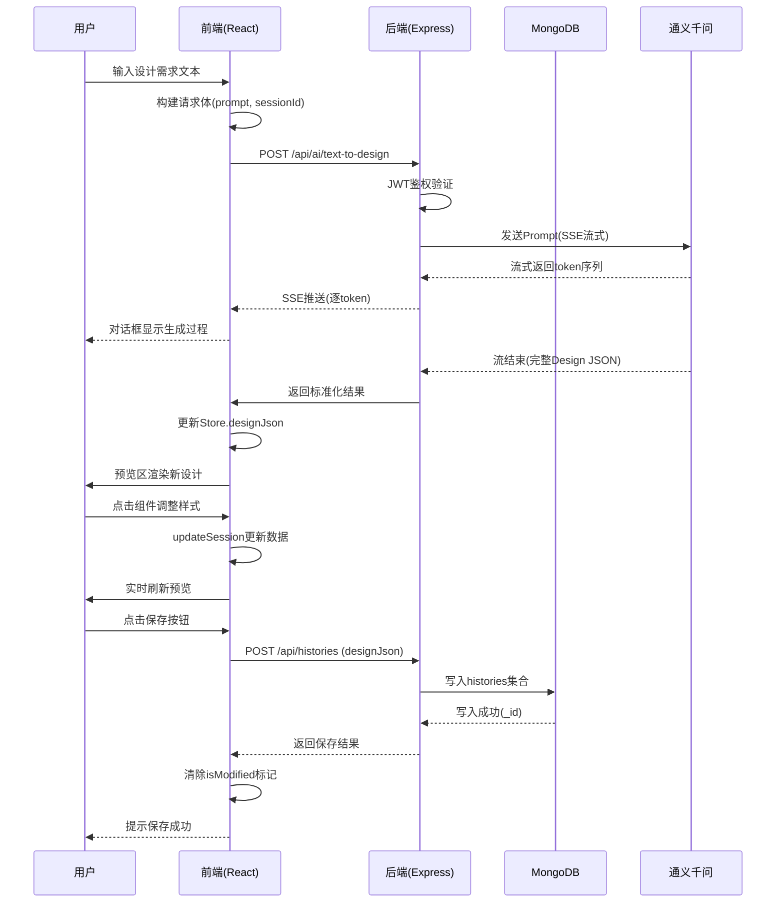
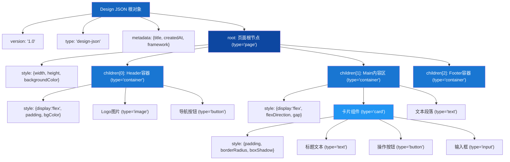

# 第四章 系统总体设计

基于第三章对系统功能需求与非功能需求的深入分析，本章将详细阐述系统的整体架构设计、技术选型决策与模块划分方案。系统设计遵循软件工程的最佳实践\[25]，在保证功能完整性的前提下，充分考虑系统的可扩展性、可维护性与用户体验。

## 4.1 技术选型说明

### 4.1.1 前端技术栈论证

在前端框架的选择上，本系统经过对React 18、Vue 3与Angular的综合评估，最终确定采用React 18作为核心框架。这一决策主要基于以下三方面考量：首先，React采用的虚拟DOM（Virtual DOM）机制与高效的Diff算法能够完美适配Design JSON数据模型的高频更新场景——当用户通过属性面板修改组件样式或AI生成新的设计稿时，虚拟DOM可以智能计算最小变更集并批量更新视图，从而避免不必要的DOM重绘操作\[9]。其次，React拥有成熟的TypeScript支持体系，其丰富的类型定义生态（如@types/react、@types/react-dom）能够在编译阶段捕获大部分类型错误，这对于包含复杂嵌套结构的Design JSON数据处理尤为重要。最后，React庞大的社区生态为系统开发提供了充足的组件库、状态管理工具与调试插件支撑，显著降低了开发成本与技术风险。

在构建工具层面，本系统选用Vite替代传统的Webpack作为项目构建工具。Vite基于原生ES模块（ESM）的开发服务器实现了毫秒级的冷启动速度，其热模块替换（HMR）机制在文件保存后可即时反映到浏览器预览中，这对可视化编辑器的实时预览功能至关重要\[26]。此外，Vite采用Rollup进行生产环境打包，生成的代码体积更小、加载速度更快，符合Web应用性能优化的最佳实践。

在状态管理方案的选择上，本系统采用了Zustand而非Redux或MobX等传统方案。Zustand的核心优势在于其极简的API设计与轻量级的代码体积（压缩后仅约1KB），同时提供了细粒度的订阅控制能力——组件可以选择性地订阅Store中的特定状态片段，当无关状态发生变化时不会触发不必要的重渲染\[13]。这种特性对于包含大量组件节点的Design JSON渲染场景尤为关键，可以有效避免性能瓶颈。此外，Zustand内置的中间件机制（如devtools用于调试、persist用于持久化）为开发过程提供了便利，且其函数式的编程风格与React Hooks理念高度契合，降低了团队成员的学习曲线。

### 4.1.2 后端技术栈论证

后端服务层采用Node.js运行时配合Express框架搭建RESTful API服务。选择Node.js的首要原因在于其JavaScript全栈特性——前后端使用统一编程语言可以实现代码复用（如Design JSON的数据校验逻辑、工具函数等），降低维护成本。更重要的是，Node.js基于事件循环的非阻塞I/O模型天然适合处理AI服务的异步调用场景：当系统向通义千问大模型发送请求时，Node.js不会阻塞主线程等待响应，而是继续处理其他用户的并发请求，从而实现更高的吞吐量与资源利用率\[10]。

在数据库选型方面，本系统采用MongoDB作为持久化存储方案。这一选择的核心理由在于Design JSON数据模型本身的特征——它是一种深度嵌套的树形结构文档，包含了组件节点、样式属性、子元素递归关系等复杂数据。MongoDB作为文档型NoSQL数据库，原生支持嵌套文档存储与灵活的Schema设计，无需像关系型数据库那样进行繁琐的表关联查询即可完整保存或读取一份Design JSON\[11]。此外，MongoDB Atlas云服务提供的自动备份、水平扩展与监控告警等功能，使得系统运维工作大幅简化，非常适合毕设项目的快速迭代需求。

在身份认证机制上，本系统采用JSON Web Token（JWT）标准实现无状态的用户认证。JWT Token自包含用户身份信息（如用户ID、角色权限），服务端验证Token签名合法性后即可完成认证，无需每次请求都查询数据库，有效降低了认证延迟\[12]。同时，JWT的无状态特性使其天然适合前后端分离架构——前端将Token存储于localStorage中，后续API请求通过Authorization头部携带Token即可，简化了跨域认证的实现复杂度。

### 4.1.3 AI服务选型论证

本系统的AI能力层依托通义千问（Qwen）大模型提供文本理解、图像解析与代码生成等核心能力。选择通义千问主要基于以下考量：其一，通义千问在中文自然语言处理领域表现优异，能够准确理解国内用户的设计需求描述，避免了海外模型在中文语境下的理解偏差问题\[17]。其二，通义千问提供的8K上下文窗口足以容纳完整的Design JSON数据注入需求——系统可以将当前设计稿的结构化信息作为上下文传入Prompt，使模型能够基于现有设计进行增量修改而非完全重新生成。其三，相较于GPT-4或Claude等商业模型，通义千问的API定价更为亲民，符合毕设项目的预算约束。此外，通义千问对Server-Sent Events（SSE）流式输出协议的支持良好，可以实现AI生成过程的逐字展示效果，提升用户体验的流畅度。

考虑到外部AI服务的依赖风险（网络延迟波动、服务不可用、配额限制等），本系统设计了完善的降级策略：当通义千问API调用失败时，系统会自动切换至本地Mock数据生成器，返回预设的常见页面模板（如登录页、首页、列表页等）作为备选结果，确保核心功能的可用性不受单一服务故障的影响。

### 4.1.4 技术栈总结

综合考量开发效率、运行性能、生态成熟度与项目成本等多维度因素，本系统最终确定了"React 18 + Vite + TypeScript"的前端技术组合、"Node.js + Express + MongoDB"的后端服务架构以及"通义千问大模型 + 本地降级策略"的AI能力供给方案。这一技术栈在保证系统功能完整性（文本生成、图像解析、可视化编辑、代码导出）的同时，兼顾了开发效率与长期可维护性，为后续章节的详细设计与实现奠定了坚实的技术基础。

## 4.2 系统整体架构

### 4.2.1 核心架构思想

本系统的架构设计遵循三大核心思想，这些思想贯穿于四层架构的每一层设计中，构成了系统设计的理论基石。

**Single Source of Truth（单一真实数据源）**

单一真实数据源原则强调系统中某一类数据应存在唯一的权威表示，所有功能模块对该数据的读写操作均需通过统一的接口进行。在本系统中，Design JSON被确立为页面设计的唯一真实数据源——无论是AI生成的新设计稿、用户在属性面板中的编辑操作，还是从历史记录恢复的旧版本，最终都会汇聚为同一份驻留于全局状态管理器中的Design JSON对象\[27]。这种设计消除了多份数据副本同步带来的不一致风险，确保了预览区域渲染的内容、属性面板显示的值以及待保存至数据库的数据始终保持一致。此外，单一数据源还使得每一次状态变更都具有明确的来源标识（AI生成、用户编辑或历史恢复），便于实现撤销/重做（Undo/Redo）等高级交互功能。

**数据驱动闭环（Data-Driven Closed Loop）**

数据驱动闭环是本系统最具特色的工作模式创新。传统的前端开发流程通常遵循"设计稿→手写代码→浏览器预览→发现问题→返回修改"的线性路径，设计师与开发者之间存在明显的协作鸿沟\[20]。而本系统构建了"用户输入→AI生成→可视化预览→用户编辑→数据更新→实时渲染→代码导出"的闭环工作流：用户通过自然语言描述或上传图片触发AI生成初始Design JSON，该数据立即驱动渲染引擎呈现可视化的页面预览；用户可以在预览界面中直接选中组件并通过属性面板调整样式，每一次编辑操作都会更新底层的Design JSON数据；更新后的数据又即时反馈到预览视图中，形成所见即所得（WYSIWYG）的编辑体验；最终确认后的Design JSON可通过代码生成引擎转换为可运行的React/Vue/HTML代码。整个过程中，异构的操作输入（文本、图片、鼠标点击、键盘输入）被归一化为统一的数据变换（Design JSON的增删改操作），极大降低了用户的使用门槛与学习成本。

**高内聚低耦合原则**

高内聚低耦合是软件架构设计的经典原则\[22]，在本系统中体现为各功能模块职责清晰、接口标准化的设计特点。表现层的React组件专注于UI渲染与事件分发，不包含任何业务逻辑；业务逻辑层的Design JSON处理器封装了数据遍历、查找、转换等纯函数，不依赖具体的UI框架实现；数据层的MongoDB操作与本地缓存策略相互独立，通过Repository模式对外提供服务；AI服务层通过适配器模式隔离了具体的大模型调用细节，使得未来替换为其他AI服务商（如GPT-4、Claude）时仅需修改适配器而无需改动业务层代码。层间通信遵循依赖倒置原则——上层通过抽象接口调用下层能力，下层不知道上层的存在，这种松耦合设计保证了系统的可测试性与可扩展性。

### 4.2.2 四层架构设计详述

基于上述核心架构思想，本系统采用经典的四层分层架构设计，自顶向下依次为表现层、业务逻辑层、数据层与AI服务层。每一层承担明确的职责边界，层间通过标准化接口进行通信，共同支撑系统的完整功能。

**第一层：表现层（Presentation Layer）**

表现层负责用户界面的渲染展示与交互事件的处理分发，是基于React 18构建的单页应用（SPA）。系统采用三栏式布局结构：左侧侧边栏提供功能模块导航入口（文本生成、图像解析、代码生成）与历史记录列表；中间对话区域承载用户输入框与AI回复消息流，支持SSE流式输出的逐字展示效果；右侧预览区域集成可视化编辑器与代码预览视图的双模切换功能。在技术实现上，表现层充分利用React Router v6的客户端路由能力实现功能模块的按需加载（Lazy Loading），减少首屏资源体积；使用CSS Modules结合CSS Variables实现样式隔离与明暗主题的无缝切换；通过Custom Hooks（如useSelection、useDragAndDrop、useKeyboardShortcuts）封装可复用的交互逻辑，保持组件代码的简洁性。值得注意的是，表现层严格遵循"瘦客户端"设计原则——组件内部不直接操作业务数据，而是通过调用业务逻辑层暴露的Hooks接口发起状态变更请求，确保UI与业务的解耦。

**第二层：业务逻辑层（Business Logic Layer）**

业务逻辑层是系统的核心中枢，负责Design JSON数据的全生命周期管理。该层主要由三大模块构成：首先是Design JSON处理器集合，包括designJsonUtils.js（提供JSON树的深度优先遍历、按ID查找节点、不可变更新、子节点删除等基础操作）、designJsonAdapter.js（处理不同版本格式的兼容转换）以及styleConverter.js（将Design JSON的样式属性对象转换为CSS字符串）。其次是全局状态管理Store（store.js），基于React Context API与Hooks实现，维护着sessions字典结构——每个会话ID对应一个独立的会话状态对象，包含designJson（当前设计稿）、conversations（对话消息数组）、previewState（预览模式）、isModified（是否已修改）等关键字段\[28]。Store对外暴露setCurrentDesignJson、updateSession、restoreHistory等方法供表现层调用，内部通过useCallback与useMemo优化性能，避免不必要的重渲染。第三是自定义Hooks库，包括useHistory（历史记录的增删改查）、useSelection（组件选中与高亮逻辑）、useDragAndDrop（拖拽排序的状态机管理）等，这些Hooks将复杂的交互逻辑抽象为声明式的API，使得表现层组件只需关注"做什么"而非"怎么做"。

**第三层：数据层（Data Layer）**

数据层采用混合存储策略，针对不同生命周期的数据选择最适合的存储介质。对于运行时的热数据（当前正在编辑的Design JSON、选中状态、对话消息等），直接驻留于前端的内存态Store中，保障毫秒级的读写响应速度；对于需要持久化的冷数据（用户账号信息、历史设计稿记录、生成的代码文件等），则异步写入MongoDB Atlas云端数据库。本系统设计了两个核心集合：users集合存储用户的基本信息（邮箱、加密密码、用户名、头像等），historySchema集合以嵌套文档形式完整保存每次生成或编辑的设计记录，包括moduleType（功能类型标识）、userInput（原始输入）、designJson（完整的设计数据）、generatedCode（可选的代码输出）、conversations（对话历史）以及imagePaths（图片路径列表）等字段\[11]。为了平衡实时性与可靠性，数据层实现了乐观更新（Optimistic Update）机制——用户编辑操作先立即更新UI视图，再异步提交至后端持久化，若网络请求失败则回滚至前一状态并提示用户重试。此外，localStorage被用作轻量级的本地缓存介质，存储JWT Token（7天有效期）、用户偏好设置（主题模式、侧边栏折叠状态）以及未保存的草稿数据，防止意外关闭浏览器导致的工作成果丢失。

**第四层：AI服务层（AI Service Layer）**

AI服务层是对外接人工智能能力的封装与编排层，旨在为业务逻辑层提供统一、可靠、可降级的智能生成接口。该层采用适配器模式（Adapter Pattern）设计，定义了标准的AI服务接口规范（如textToDesign、imageToDesign、designToCode三个核心方法），底层通过qwenService.js适配器封装通义千问API的具体调用细节（包括鉴权配置、请求参数组装、SSE流式响应解析、错误码处理等）\[17]。在Prompt工程方面，conversationManager.js模块负责构建高质量的提示词模板——采用"系统指令+历史对话摘要+当前Design JSON上下文+用户指令"的四段式结构，其中系统指令定义模型的输出格式约束（必须返回合法的JSON格式Design JSON），历史对话保留最近3轮以确保上下文连贯性，当前Design JSON的注入使模型能够理解已有设计并进行增量修改而非重复生成。AI服务层还内置了完善的降级与容错机制：当检测到API超时（>30秒）、HTTP非200状态码、返回内容无法解析为合法JSON或配额耗尽等异常情况时，系统会自动切换至mockDesignGenerator.js本地生成器，根据用户输入的关键词匹配预设的10余种常见页面模板（登录页、注册页、首页、列表页、详情页、个人中心等），并随机变化颜色、间距等样式属性增加输出多样性，确保即使在AI服务完全不可用的极端场景下，系统仍能提供基本可用的设计生成能力。

图4-1展示了本系统的四层架构及其数据流向：

图4-1: 系统四层架构图

### 4.2.3 架构图详细说明

如图4-1所示，本系统采用清晰的四层分层架构，各层之间通过标准化接口进行单向依赖，形成稳定的层次关系。表现层位于架构最顶层，基于React 18构建的三栏式SPA界面直接面向终端用户，负责接收鼠标点击、键盘输入、拖拽操作等交互事件，并将这些事件转化为对业务逻辑层方法调用。业务逻辑层作为系统的核心枢纽，一方面向上为表现层提供声明式的状态访问接口（如currentDesignJson、selectedId等计算属性）与命令式的状态变更方法（如setCurrentDesignJson、updateSession等）；另一方面向下协调数据层的读写操作与AI服务层的生成请求。数据层采用三级混合存储架构：运行时内存承载高频访问的热数据（当前Design JSON、选中状态等），MongoDB Atlas负责长期持久化的冷数据（用户信息、历史记录），LocalStorage充当轻量级的本地缓存（Token、偏好设置）。AI服务层位于架构最底层，通过适配器模式隔离了通义千问大模型的具体调用细节，并为上层提供统一的text-to-design、image-to-design、design-to-code三类生成接口；内置的降级策略（图中虚线箭头所示）确保了在外部AI服务异常时系统仍能维持基本可用性。整体架构体现了"数据驱动视图、视图反馈数据"的闭环设计理念，为系统的稳定运行与持续演进提供了坚实的结构基础。

## 4.3 系统模块划分

### 4.3.1 数据层/存储模块架构

数据层是系统运行的基石，负责所有结构化数据的持久化存储、检索查询与一致性保障。本系统采用MongoDB作为主存储引擎，设计了users与histories两个核心集合来支撑用户管理与设计记录管理的业务需求。

**MongoDB Schema设计**

users集合用于存储注册用户的基本信息，其Schema定义包含以下字段：\_id（ObjectId类型的主键）、email（String类型，设置唯一索引确保邮箱地址全局唯一）、password（String类型，存储bcrypt算法加密后的密码哈希值）、username（String类型，默认空字符串）、avatar（String类型，存储头像URL地址）以及createdAt（Date类型，记录账户创建时间）。在安全设计方面，password字段采用bcryptjs库进行加盐哈希处理（salt rounds设为10），即使数据库泄露攻击者也无法直接还原明文密码；email字段强制小写化与首尾空白去除处理，避免因大小写差异导致的重复注册问题\[12]。

histories集合是本系统最核心的数据实体，用于完整保存每次AI生成或用户编辑的设计记录。其Schema设计充分体现了NoSQL文档型数据库处理嵌套结构的优势：userId字段（ObjectId类型，关联User集合）建立用户归属关系并建立复合索引加速查询；moduleType字段（枚举类型，取值为'text-to-design'、'image-to-design'或'design-to-code'）标识本次记录的功能来源；title与userInput字段分别记录用户自定义标题与原始输入内容；designJson字段采用Mixed类型（即无固定Schema约束），可以灵活存储任意深度的嵌套Design JSON文档而不需要进行预先的字段定义；generatedCode字段同样采用Mixed类型，存储AI代码生成引擎输出的完整文件列表（包含文件名、内容、语言类型等信息）；framework字段标识目标代码框架（react/vue/html）；imagePaths数组字段存储上传图片的服务器路径列表；conversations字段采用Mixed类型存储完整的对话消息序列（每条消息包含role、content、timestamp及可选的designJson版本锚点）；createdAt与updatedAt字段分别记录创建时间与最后更新时间，updatedAt字段的自动更新机制通过Mongoose中间件实现\[11]。特别值得一提的是，historySchema在userId与createdAt上建立了复合降序索引，使得"查询某用户最近N条历史记录"这一高频操作的查询效率得到显著提升。

表4-2详细列出了两个集合的字段定义与约束说明：

表4-2: MongoDB集合字段定义表

| 集合名       | 字段名           | 数据类型      | 约束条件       | 说明              |
| --------- | ------------- | --------- | ---------- | --------------- |
| users     | \_id          | ObjectId  | 主键，自动生成    | 用户唯一标识          |
| users     | email         | String    | 必填，唯一索引，小写 | 用户登录邮箱          |
| users     | password      | String    | 必填         | bcrypt加密后的密码哈希  |
| users     | username      | String    | 默认空字符串     | 显示名称            |
| users     | avatar        | String    | 默认空字符串     | 头像URL地址         |
| users     | createdAt     | Date      | 自动生成       | 账户创建时间          |
| histories | \_id          | ObjectId  | 主键，自动生成    | 记录唯一标识          |
| histories | userId        | ObjectId  | 必填，索引      | 关联User集合        |
| histories | moduleType    | String    | 枚举值        | 功能类型标识          |
| histories | title         | String    | 默认空字符串     | 用户自定义标题         |
| histories | userInput     | String    | 默认空字符串     | 原始输入内容          |
| histories | designJson    | Mixed     | 可为null     | 完整Design JSON文档 |
| histories | generatedCode | Mixed     | 可为null     | 生成的代码结果         |
| histories | framework     | String    | 枚举值        | 目标代码框架          |
| histories | imagePaths    | \[String] | 默认空数组      | 上传图片路径列表        |
| histories | conversations | Mixed     | 默认空数组      | 对话消息序列          |
| histories | createdAt     | Date      | 自动生成       | 创建时间            |
| histories | updatedAt     | Date      | 自动更新       | 最后修改时间          |

**存储策略与数据一致性**

数据层采用分级存储策略以优化性能与成本的平衡。运行时阶段，当前活跃会话的Design JSON、选中状态、对话消息等热数据全部驻留于前端的React Context Store中，利用JavaScript内存的高速读写能力保障交互的实时响应（通常在16ms以内完成一次状态更新与视图重渲染，满足60fps的流畅度要求）。当用户执行保存操作或触发自动保存机制（防抖延迟2秒）时，系统会将当前的会话状态异步提交至后端Express路由，经由Mongoose ODM写入MongoDB Atlas集群。写入操作采用乐观更新策略——前端立即假设保存成功并更新UI状态（如清除"未保存"标记），后台异步执行实际的数据库写入；若写入失败（网络中断、权限不足等原因），前端会回滚UI状态并弹出错误提示引导用户重试。对于并发冲突场景，本系统采用"最后写入胜出（Last Write Wins）"策略解决——基于updatedAt时间戳判断版本的新旧，后到达的写请求总是覆盖先前的数据，这种简单策略在单用户编辑为主的使用场景下具有足够的实用性\[22]。此外，localStorage被用作最后一道防线，在用户关闭浏览器前自动将当前未保存的草稿序列化为JSON字符串存入本地，下次打开时可选择恢复，防止意外情况导致的工作成果丢失。

### 4.3.2 AI生成模块/文件管理服务

AI生成模块是本系统的核心差异化能力所在，它将大语言模型的自然语言理解与视觉感知能力转化为结构化的Design JSON输出，打通了从模糊意图到精确设计的智能桥梁。该模块包含文本生成、图像解析与代码生成三个子服务，以及统一的降级容错机制。

**文本生成服务（Text-to-Design）**

文本生成服务允许用户通过自然语言描述期望的页面设计，AI将其转化为可视化的Design JSON并在预览区实时渲染。该服务的API端点定义为POST /api/ai/text-to-design，请求体包含prompt（用户输入文本）、sessionId（会话标识）与可选的currentDesignJson（当前设计稿，用于增量修改场景）。处理流程首先由conversationManager模块构建四段式Prompt：第一段为系统指令，明确告知模型"你是一个前端设计专家，请根据用户描述生成符合Design JSON规范的页面结构"；第二段注入最近3轮的历史对话摘要，保持上下文连贯性；第三段嵌入当前Design JSON的结构化信息（如有），使模型理解已有设计基础；第四段拼接用户的最新指令文本\[17]。随后，qwenService适配器将Prompt通过HTTP POST发送至通义千问API，并开启SSE（Server-Sent Events）监听流式响应——模型生成的每一个token都会实时推送到前端，在对话框中以打字机效果逐字展现。当流结束标志到来后，服务端会尝试从完整响应中提取JSON格式的Design JSON字符串，经JSON Schema合规性校验（检查version、type、root等必要字段是否存在）后返回标准化结果。若校验失败或API调用异常（超时、网络错误、返回非法格式等），系统自动触发降级流程。

**图像解析服务（Image-to-Design）**

图像解析服务赋予系统"看懂"UI截图的能力——用户上传一张网页或App的界面截图，AI分析其中的布局结构、组件类型与样式属性，还原为可编辑的Design JSON。该服务的API端点定义为POST /api/ai/image-to-design，采用multipart/form-data格式接收图片文件（支持PNG/JPG格式，限制5MB以内）。处理流程首先对上传文件进行格式校验与大小检查，随后保存至服务器uploads/images目录获取可访问URL。接着构建专门的视觉理解Prompt（如"请仔细分析这张UI截图，识别出页面的整体布局结构（Header/Main/Footer等区域划分）、包含哪些UI组件（按钮、输入框、图片、卡片等）、各组件的相对位置关系、以及主要的视觉样式特征（配色方案、字体大小、间距规则等），并将其转换为标准的Design JSON格式输出"），调用通义千问VL（Vision-Language）多模态模型进行图像理解\[19]。模型提取出的结构化信息经映射转换为Design JSON树形结构，其中组件类型依据视觉特征映射至系统预设的类型体系（圆角矩形带文字→button，横向排列的多个元素→flex container，单行文本→text等）。针对复杂排版识别准确率较低的技术挑战，系统在Post-processing阶段引入启发式修正规则：如自动推断主色调为出现频率最高的前三色值、将相近字号合并为标准尺寸系列（12/14/16/18/24px）等，在一定程度上弥补模型视觉理解的精度不足。

**代码生成服务（Design-to-Code）**

代码生成服务位于设计工作流的末端，负责将确认无误的Design JSON转换为可直接运行的前端代码。该服务的API端点定义为POST /api/ai/design-to-code，请求体包含designJson（待转换的设计数据）与framework（目标框架标识，支持react/vue/html三种选项）。核心算法采用递归深度优先遍历策略：从Design JSON的根节点出发，根据node.type字段查找对应的代码模板（如container→`
`，text→`{content}`，button→`<button onClick={...}>{content}</button>`等），递归处理children子节点数组生成嵌套的JSX/Vue Template/HTML标签树；同时，style对象的各属性经styleConverter转换为CSS语法（如padding数组`[10,20,10,20]`→`padding: 10px 20px`，flexDirection枚举→CSS属性名）。最终输出包含多个文件的完整项目结构（如React模式下生成App.jsx组件文件、App.css样式文件、index.html入口文件等），前端可在代码预览区查看或一键下载\[29]。值得说明的是，虽然代码生成本质上也可由AI大模型完成（将Design JSON注入Prompt让模型生成代码），但本系统采用规则驱动的模板引擎方案——优点是输出确定性高、速度快（毫秒级）、无Token消耗成本；缺点是灵活性有限，无法处理超出预设模板范围的复杂组件。未来可考虑引入AI辅助增强代码生成的智能化程度。

**降级策略与容错机制**

AI服务的稳定性直接关系到用户体验，本系统设计了多层防御机制应对外部依赖的不确定性。第一层是网络层面的超时控制——所有API请求设置30秒硬超时，避免因模型推理耗时过长导致前端长时间挂起。第二层是响应内容的格式校验——无论API返回何种内容，都必须能成功解析为合法的Design JSON结构，否则视为无效响应。第三层是统一的异常捕获与降级切换——qwenService内部的callWithFallback方法包裹try-catch块，捕获任何类型的异常后立即调用mockDesignGenerator生成备选结果。Mock生成器内部维护了一个包含10余种常见页面模板的预设库（登录注册页、电商首页、文章列表页、商品详情页、个人中心页、404错误页等），根据用户输入文本的关键词（如"登录"、"商品"、"列表"等）匹配相似度最高的模板，并对模板的颜色、间距、字号等样式属性施加随机扰动以增加输出多样性\[30]。这种"真实AI优先、Mock兜底"的策略确保了系统在各种异常场景下都不会完全失效，只是生成质量有所下降，属于合理的优雅退化（Graceful Degradation）。

图4-2展示了系统各模块之间的协作关系：

图4-2: 系统模块关系图

图4-3进一步描绘了典型用户操作场景下的数据流向：

图4-3: 数据流向图（DFD）

### 4.3.3 可视化编辑模块

可视化编辑模块是本系统区别于传统AI代码生成工具的核心创新点——它赋予了用户在AI生成结果基础上进行精细化调整的能力，实现了"AI生成初稿+人工精修完善"的协同工作模式。该模块由DesignRenderer渲染引擎、VisualEditor交互控制器与PropertyPanel属性面板三大组件协同构成。

**DesignRenderer渲染引擎**

DesignRenderer是可视化编辑模块的技术核心，其职责是将Design JSON的树形数据结构递归映射为可视化的React组件树。渲染算法采用深度优先遍历（DFS）策略：从根节点（root）出发，根据node.type字段在组件映射表中查找对应的React组件（如container→div容器、text→span文本元素、button→button按钮、input→input输入框、image→img图片、card→带阴影的div卡片、divider→hr分割线等共8种基础组件类型）；随后调用convertStyleToCSS工具函数将node.style对象转换为合法的CSS样式字符串（处理数组形式的padding/margin、枚举形式的flexDirection等特殊格式）；判断当前节点是否为用户选中的目标节点（比较node.id与全局selectedId），若是则附加'selected'CSS类名以显示高亮边框；最后递归渲染children子节点数组，将子组件作为当前组件的children插入\[9]。在性能优化方面，DesignRenderer充分利用React.memo对叶子组件进行记忆化包裹——自定义的比较函数仅在node.id、selectedId或style对象的浅比较结果发生变化时才允许重渲染，有效避免了父节点状态更新引发的整棵子树无谓重绘。此外，useMemo Hook被用于缓存样式转换的计算结果，避免每次渲染都重复执行字符串拼接操作。

**VisualEditor交互控制器**

VisualEditor作为编辑模块的协调者，管理着用户的所有编辑操作并协调渲染器与属性面板的同步更新。其内部维护两份关键状态：designJson（当前编辑的设计数据，来源于Store的currentDesignJson）与selectedIdRef（当前选中组件ID的Ref引用，使用Ref而非State是为了避免选中状态变化触发的连锁重渲染）。当外部传入新的initialDesignJson（如AI刚生成的新设计稿或从历史记录恢复的旧版本）时，useEffect钩子会检测差异并更新内部状态，同时验证原选中节点在新数据中是否仍然存在，若不存在则自动选中根节点的第一个子组件作为默认选中项。VisualEditor处理的四大核心操作包括：（1）组件选中——用户点击预览区的某个组件，onClick事件沿DOM树冒泡至根容器，事件处理器通过event.target回溯至对应的Design JSON节点并设置selectedIdRef；（2）属性更新——用户在属性面板修改某项样式值，onChange回调触发updateNodeImmutable纯函数（基于不可变数据原则生成全新的Design JSON副本），再调用setDesignJson提交至Store；（3）拖拽排序——useDragAndDrop Hook管理拖拽状态机（idle→dragging→dropped），calculateDropPosition函数计算放置位置并重新排列父节点的children数组顺序；（4）撤销重做——useHistory Hook维护操作历史栈（最大深度50步），Ctrl+Z/Y快捷键触发栈的pop/push操作恢复历史版本的Design JSON\[27]。

**PropertyPanel属性面板**

PropertyPanel是用户与Design JSON数据进行细粒度交互的主要界面控件。面板根据当前选中组件的type动态渲染对应的属性编辑表单，属性分组策略如下：基础属性组包含width、height、backgroundColor、opacity等外观维度参数；布局属性组涵盖display、flexDirection、justifyContent、alignItems、flexWrap、gap等Flexbox布局相关属性；间距属性组提供padding与margin的四方向数组输入（对应CSS的上右下左顺序）；外观属性组包含borderRadius、border、boxShadow等装饰性属性；文本属性组（仅text类型组件显示）涵盖color、fontSize、fontWeight、textAlign、lineHeight等字体排版参数。每种属性对应特定类型的表单控件：数值类属性使用type="number"的input元素，颜色类属性使用原生color拾取器，枚举类属性使用select下拉菜单，数组类属性则拆分为四个独立的数值输入框。所有控件均实现双向数据绑定——value绑定当前样式值，onChange触发handleUpdateProperty方法更新Design JSON对应节点的style字段，更新立即通过Store传递至DesignRenderer触发视图刷新，形成所见即所得的编辑体验\[20]。

图4-4展示了Design JSON数据模型的树形结构：

图4-4: Design JSON数据模型图

表4-1总结了系统各主要模块的职责划分：

表4-1: 系统模块职责划分表

| 模块名称           | 所属层级  | 核心职责                      | 关键文件/组件                                                      | 对外接口                                                  |
| -------------- | ----- | ------------------------- | ------------------------------------------------------------ | ----------------------------------------------------- |
| 表现层UI组件        | 表现层   | 页面渲染与交互事件处理               | Layout, Sidebar, ConversationArea, PreviewArea, VisualEditor | 无（消费上层接口）                                             |
| DesignRenderer | 表现层   | Design JSON到React组件树的递归映射 | DesignRenderer.jsx, DesignNode.jsx                           | 接收designJson与selectedId，输出JSX                         |
| 全局状态Store      | 业务逻辑层 | 会话状态的集中管理与持久化             | store.js (AppProvider/AppContext)                            | setCurrentDesignJson, updateSession, restoreHistory等  |
| Design JSON处理器 | 业务逻辑层 | 设计数据的遍历、查找、转换操作           | designJsonUtils.js, designJsonAdapter.js, styleConverter.js  | findNodeById, updateNodeImmutable, convertStyleToCSS等 |
| 自定义Hooks       | 业务逻辑层 | 交互逻辑的封装与复用                | useSelection.js, useDragAndDrop.js, useHistory.js            | selection状态, drag handlers, undo/redo方法               |
| 用户认证服务         | 数据层   | 注册、登录、Token签发与验证          | authMiddleware.js, userController.js                         | POST /api/auth/register, /login                       |
| 历史记录服务         | 数据层   | 设计记录的CRUD操作               | historyController.js                                         | GET/POST/DELETE /api/histories                        |
| AI文本生成服务       | AI服务层 | 自然语言到Design JSON的转换       | qwenService.js, conversationManager.js                       | POST /api/ai/text-to-design                           |
| AI图像解析服务       | AI服务层 | UI截图到Design JSON的还原       | imageService.js                                              | POST /api/ai/image-to-design                          |
| 代码生成服务         | AI服务层 | Design JSON到前端代码的转换       | codeGenerator.js                                             | POST /api/ai/design-to-code                           |
| 降级Mock服务       | AI服务层 | API异常时的备选数据生成             | mockDesignGenerator.js                                       | 内部调用（透明降级）                                            |

## 4.4 本章小结

本章围绕系统的总体设计展开论述，完成了从技术选型论证到架构设计再到模块划分的全景式阐述。在技术选型层面，综合对比了多种主流方案的优劣，最终确定了适合本系统特性的前后端技术栈与AI服务方案，每一项决策都有明确的技术理由与适用场景分析。在架构设计层面，提出了单一真实数据源、数据驱动闭环与高内聚低耦合三大核心架构思想，并在此基础上设计了表现层、业务逻辑层、数据层与AI服务层的四层分层架构，明确了各层的职责边界与接口规范。在模块划分层面，深入剖析了数据层的MongoDB Schema设计与混合存储策略、AI生成模块的三类服务及其降级容错机制、可视化编辑模块的渲染引擎与交互控制器等技术细节，并通过架构图、模块关系图、数据流向图与数据模型图等多种可视化手段增强了表述的清晰度。

本系统架构设计的核心创新点在于：以Design JSON作为单一真实数据源贯穿全流程，实现了AI生成、可视化编辑与代码导出的无缝衔接；构建了数据驱动的闭环工作模式，将异构的用户操作归一化为统一的数据变换，降低了使用门槛；采用低代码的可视化编辑范式，使用户无需编写代码即可精细调整AI生成的设计结果。上述架构设计为下一章的详细实现奠定了清晰的技术蓝图——第五章将深入各子系统的代码实现细节，包括数据库操作的具体SQL语句、核心算法的伪代码实现、关键组件的完整源码解读等内容。
